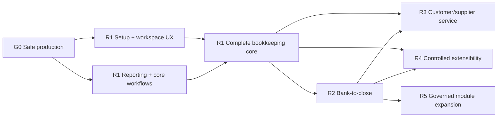

# Business Finlynq product implementation work order

Status: implementation-ready planning baseline, authored 2026-08-28.

This is the durable product-and-delivery plan for turning the current writable accounting demo into a production bookkeeping service. It translates the [competitive fit-gap analysis](../competitive-fit-gap-plan-2026-08.md) into sequenced work packages that can be estimated, assigned, implemented, tested, and released later.

Use this document with, not instead of:

- [ADR 001 — foundation](../architecture/001-foundation.md), which owns the architectural invariants;
- the [engineering implementation handoff](codex-implementation-plan.md), which owns known code-level remediation and technical details; and
- the [build roadmap](../roadmap.md), which records milestone status.

If the documents disagree, the precedence is: accepted ADRs, this work order's release priorities, the engineering handoff's code-level instructions, then the older roadmap. Resolve a material conflict with an ADR before implementation.

---

## 1. Intended product outcome

The first production product should let a small or midsize, accountant-supported service or non-stock business:

1. create and configure a real organization safely;
2. import or enter opening data and prove that it ties out;
3. run sales, purchases, payments, journals, tax, and period close;
4. import bank activity, match it, reconcile accounts, and resolve exceptions;
5. produce dependable financial statements, ledgers, aging, statements, and audit evidence;
6. work quickly with keyboard-first lists and line-entry grids; and
7. extend the service through controlled configuration and integrations without weakening accounting controls.

The initial operating envelope is:

- Ontario HST and Washington sales/use-tax reference packs;
- CAD and USD, while preserving the existing general multicurrency model;
- ASPE and U.S. GAAP non-public accounting profiles;
- service/non-stock sales and purchases before inventory; and
- owner, accountant/approver, bookkeeper/maker, viewer/auditor, and integration identities.

This plan does not position Finlynq as a complete manufacturing ERP, tax-filing bureau, payroll calculator, or payment processor. Those boundaries must remain visible in product copy, setup, and module availability.

## 2. Priority and commitment model

Priorities are based on user necessity, accounting risk, competitive table stakes, dependency leverage, and implementation effort.

| Class | Meaning | Scheduling rule |
|---|---|---|
| P0 | Required for a safe, credible production service | Blocks the release gate that contains it |
| P1 | High-value completion of the release promise | May be flag-gated during development; required before general availability of that release |
| P2 | Valuable optimization or adjacent workflow | Schedule after P0/P1 unless it removes a measured pilot bottleneck |
| Explore | Conditional module or unproven commercial bet | Requires a scope ADR and evidence before implementation |

Relative sizes are planning aids, not time estimates:

- S: a contained change in one established boundary;
- M: several layers or one new bounded workflow;
- L: a cross-layer feature with migration, UI, operations, and substantial tests; and
- XL: a new module or multi-release program that must be decomposed before coding.

Committed release gates are G0 through R4. R5 is a governed expansion queue, not a commitment to build every listed module.

## 3. Frozen implementation guardrails

Every work package inherits these rules. They are acceptance criteria even when not repeated below.

1. Read the relevant guides under `node_modules/next/dist/docs/` before writing Next.js-specific code. This repository's Next.js conventions may differ from prior versions.
2. Move monetary values as strings. Use `decimal.js` and the existing money kernel; never use JavaScript `number` for accounting arithmetic.
3. All posted journals go through the one posting service. Posted accounting history is immutable. Corrections create linked reversals and replacements; application hard-delete is prohibited.
4. Source modules own documents and draft proposals. The ledger kernel owns posted journal rows.
5. Every mutation is tenant-resolved on the server, idempotent, authorized, rate-limited, audited, and represented in the outbox. It must fail closed when the organization cannot write.
6. Every tenant table has tenant-qualified foreign keys, row-level security, `FORCE ROW LEVEL SECURITY`, reconciled runtime grants, a matching schema declaration, backup/restore coverage, and demo-reset handling when demo-visible.
7. Sensitive identity, bank, connector, attachment, address, and tax data uses the existing organization-key envelope-encryption contract. Plaintext must not enter logs, URLs, analytics payloads, or public object-store links.
8. Bank feeds, imports, rules, and AI can create observations, suggestions, or drafts. They do not post, approve, delete history, reopen periods, or execute payments.
9. Global demo, real-account, and write flags remain independent. Real writes require both the global gate and explicit per-organization activation.
10. Module availability is explicit per organization. Disabled modules disappear from ordinary navigation but preserve historical routes and posted drill-down.
11. Accessibility, localization-safe formatting, responsive behavior, and keyboard operation are product requirements, not cleanup work.
12. A release is complete only when operations, migration, recovery, support, documentation, and observability are ready with the user-visible feature.

## 4. Release architecture and dependency map

| Gate | Product outcome | Required predecessor | Primary competitive gap closed |
|---|---|---|---|
| G0 — Safe production | A real organization can be activated, operated, recovered, observed, and deployed safely | Current foundation | Trust, activation, operational readiness |
| R1 — Complete bookkeeping core | A business can set up, transact, review, report, and close without spreadsheet workarounds | G0 | Setup, reporting, document completeness, efficient UX |
| R2 — Bank-to-close | Bank data, tax returns, and the close process form one controlled exception workflow | R1 | Banking, reconciliation, tax production, close confidence |
| R3 — Customer and supplier service | Users can manage the surrounding commercial workflow and communication | R1; selected R2 payment/bank primitives | Quotes, reminders, portals, approvals, document delivery |
| R4 — Controlled extensibility | Customers and partners can integrate and customize safely | Stable R1/R2 service boundaries | API, OAuth, webhooks, integrations, configuration |
| R5 — Modular expansion | Selected advanced modules add value without destabilizing the core | G0–R2; module-specific ADR | Inventory, projects, assets, budgets, payroll import, consolidation |

The critical production path is:

`G0 schema/mutation integrity → real-account activation → guided setup → core reporting → banking observations → reconciliation sign-off → close gate`.

Product design, fixture creation, and accounting-policy decisions may run ahead of a gate. Production implementation must not bypass an unresolved P0 blocker in a predecessor gate.

## 5. Delivery ownership and operating model

Each work package has one directly responsible owner even when several disciplines contribute. Use these ownership tracks in planning:

| Track | Accountable for |
|---|---|
| Product/accounting | Workflow definition, accounting treatment, scope, copy, acceptance fixtures, competitive fit |
| Platform/security | Tenancy, identity, encryption, migrations, authorization, audit, outbox, release controls |
| Domain engineering | Ledger, reporting, AR/AP, tax, banking, and later module services |
| Product experience | Information architecture, screen states, forms, grids, keyboard, accessibility, responsive behavior |
| Data/integrations | Imports, mappings, connectors, webhooks, exports, migration and reconciliation tooling |
| Quality/operations | Test strategy, environments, observability, backup/restore, runbooks, rollout and incident readiness |

For accounting-impacting work, the product/accounting reviewer is mandatory and cannot be replaced by a code-only review. For identity, encryption, OAuth, connector credentials, or payment-related work, a security reviewer is mandatory.

### Work-package lifecycle

Use these statuses consistently: `Proposed → Ready → In progress → In verification → Pilot → Done`, with `Blocked` as an explicit exception state.

A package is Ready only when:

- the user outcome and non-goals are written;
- dependencies and any required ADRs are resolved;
- wireframes or screen-state descriptions exist for user-facing work;
- accounting examples include normal, correction, foreign-currency, tax, and closed-period cases when relevant;
- data migration and rollback behavior are known;
- feature flags and pilot audience are named;
- acceptance tests are concrete; and
- one owner and required reviewers are assigned.

## 6. Cross-release product contracts

These contracts prevent each module from inventing a different interaction model.

### 6.1 Information architecture

The ordinary owner/bookkeeper navigation should converge on:

| Area | Screens |
|---|---|
| Home | Overview, action queue, cash snapshot, recent activity, setup/close progress |
| Sales | Customers, quotes, invoices, payments received, statements |
| Purchases | Suppliers, bills, expenses, payments made |
| Banking | Bank transactions, reconciliation, cash position |
| Accounting | Chart of accounts, journals, close and review, tax |
| Reports | Favorites, financial statements, ledgers, aging, tax and audit reports |
| Settings | Business, entities, fiscal calendars, tax, users and roles, document templates, connections |

Accountant/admin users additionally receive:

- dimensions and account-combination policy;
- posting and approval policies;
- audit explorer;
- tax-pack and registration management;
- data import/export and opening-balance validation;
- integrations, OAuth clients, API tokens, and webhooks;
- module availability and feature flags; and
- advanced template and controlled-customization settings.

The internal term `Party` should remain in the domain model but not be the primary navigation term. Use Customers and Suppliers in normal workflows, with one shared profile when an organization has both roles. Move the current Automation/MCP informational surface under Connections until it has functional tools.

### 6.2 Standard screen types

Every module should compose the smallest appropriate set of five screen types:

1. **Workspace/overview** — status, totals, exceptions, tasks, and recent activity. It links to work; it is not a report substitute.
2. **List/work queue** — saved views, filters, search, bulk-safe actions, configurable columns, export, row preview, and visible result counts.
3. **Form/composer** — progressive disclosure, clear draft state, line grid when needed, totals, validation summary, save/submit action separation, and unsaved-change protection.
4. **Detail/activity** — immutable identity, current state, source-to-journal linkage, timeline, attachments, comments, audit events, and allowed next actions.
5. **Report/reconciliation** — parameters, as-of/effective dates, drill-down, comparison, export, print/PDF, saved configuration, and an explanation of exclusions or unresolved items.

Required states for every screen are loading, empty, no-permission, disabled-module, filtered-empty, recoverable error, nonrecoverable error, read-only/closed-period, and success. Destructive-looking accounting actions must explain the reversal/correction that will occur rather than imply deletion.

### 6.3 Lists, grids, and data interaction

The shared list and line-grid foundation must support:

- server-side search, filtering, sorting, and cursor-based pagination for large sets;
- saved private views first, with role-shared views in R4;
- URL-addressable filters and selected record where safe;
- configurable columns with an organization default and user override;
- row preview without losing list context;
- multi-select only where every bulk action is explicitly safe and authorized;
- copy from selected cells and paste from a spreadsheet through a validation preview;
- inline editing only for drafts or safe master-data fields; never for posted facts;
- optimistic UI only when the server command is idempotent and conflicts are recoverable;
- clear stale-data handling using version/updated-at checks;
- totals calculated by the server using exact decimals, not from the currently rendered page; and
- export of the filtered result with spreadsheet-formula injection protection.

Posted documents and journals open in a detail screen. Drafts may open in an editor. A status badge must never be the only carrier of state; pair color with text and accessible semantics.

### 6.4 Keyboard contract

Keyboard commands are discoverable through `Shift+?`, visible in tooltips/menus, remappable only in a later accessibility setting, and disabled while typing in a field unless explicitly scoped to that field.

Global commands:

| Shortcut | Action |
|---|---|
| `Ctrl/Cmd+K` | Open command palette and global search |
| `Shift+?` | Open keyboard help |
| `/` | Focus the current list/report search |
| `G` then a letter | Go to an enabled area; show the letter map in keyboard help |
| `C` then a letter | Create a permitted record, such as invoice, bill, journal, customer, or supplier |
| `Esc` | Close the topmost nonblocking panel/menu; never discard changes silently |

Forms and composers:

| Shortcut | Action |
|---|---|
| `Alt/Option+S` | Save draft |
| `Ctrl/Cmd+Enter` | Invoke the primary next action after confirmation when needed |
| `Alt/Option+Shift+N` | Save draft and start another record |
| `Ctrl/Cmd+D` | Duplicate the current draft or selected line where permitted |
| `T` in a date field | Set today |
| `+` / `-` in a date field | Move one day; modifier variants may move one month after usability validation |

Line grids:

| Shortcut | Action |
|---|---|
| `Tab` / `Shift+Tab` | Move through editable cells and create the next line at the end |
| Arrow keys | Move between cells without entering edit mode unexpectedly |
| `Enter` | Edit/commit the focused cell according to grid mode |
| `Esc` | Revert the uncommitted cell edit |
| `Alt/Option+Up/Down` | Move a draft line |
| `Delete` | Remove a draft line with immediate undo; unavailable for posted data |
| Paste | Open a mapping/validation preview before adding multiple lines |

Do not hijack browser/operating-system shortcuts. Every command must have a pointer/touch equivalent, respect permissions and state, and be covered by browser-level tests for Windows and macOS modifier behavior.

### 6.5 Guided setup and migration contract

Setup is a resumable checklist, not one oversized wizard. Users can leave and return, invite an accountant, and see which decisions become locked after first posting.

| Step | User outcome | Required validation |
|---|---|---|
| 1. Business profile | Name, address, locale, industry, display preferences | Required identity and regional fields complete |
| 2. Legal entities | Legal names, entity numbers, functional currencies, accounting profiles | Each entity belongs to the organization; immutable-after-posting fields explained |
| 3. Tax | Registrations, jurisdictions, filing frequencies, effective dates | No unsupported tax assumption silently becomes zero |
| 4. Books | Fiscal calendar, chart template/import, dimensions, opening period | Account rules valid; reserved `0000` behavior preserved |
| 5. People and catalog | Customers, suppliers, service items, payment terms | Duplicates and dual-role parties surfaced before import |
| 6. Opening data | Opening trial balance, open invoices/bills, comparative balances | Debits equal credits; subledgers tie to control accounts |
| 7. Banking | Bank accounts and first statement/import | Opening statement balance and currency confirmed |
| 8. Documents | Numbering, logo, invoice/bill/statement templates, sender identity | Preview and test delivery pass |
| 9. Team and controls | Members, roles, approval/posting policies, MFA expectations | At least one viable owner/recovery path exists |
| 10. Validation and go-live | Readiness report and explicit activation | No blocking discrepancy; operator and customer sign-off recorded |

Every import follows: upload → detect → map → validate → preview → commit idempotently → reconcile → retain an immutable result report. Failed rows do not disappear. Users can download errors, correct them, and retry without duplicating accepted records.

### 6.6 Customization contract

Customization is tiered by risk.

**Tier 1 — safe configuration, available in R1/R2**

- chart of accounts, dimensions, numbering, payment terms, tax mappings;
- document templates, logos, email text, saved views, report favorites;
- role templates and approval/posting policies; and
- enabled modules and organization defaults.

**Tier 2 — controlled automation, available in R4**

- custom fields on approved objects with typed schemas and field-level permissions;
- deterministic rules that produce suggestions or drafts;
- approval routing, notifications, scheduled report delivery, and webhook subscriptions; and
- organization-shared views and report-layout variants.

**Tier 3 — extensions, available only after the R4 security gate**

- OAuth applications, scoped APIs, signed webhooks, connector packages, and explicitly approved UI extension points.

Never permit arbitrary tenant code in the application process or database. Custom fields cannot alter posted accounting facts, bypass journal validation, replace immutable identifiers, or become an unreviewed tax engine. Configuration changes are effective-dated or versioned when they affect future accounting outcomes.

### 6.7 Module contract

Every new module must declare:

- module key, version, dependencies, permissions, navigation entries, feature flags, and lifecycle state;
- owned documents, state machines, commands, read models, and correction behavior;
- journal-type definitions and mapping to the one posting service;
- accounting control accounts and a reconciliation report back to its subledger;
- setup steps, default roles, audit/outbox events, import/export formats, and retention rules;
- demo availability and reset/seed behavior; and
- disable behavior that preserves history and read-only drill-down.

A module is not complete until its control-account reconciliation passes with zero unexplained difference for its acceptance fixtures.

### 6.8 Module and screen delivery catalog

This catalog is the implementation target for the visible product. Logical screen names are stable product concepts; physical routes may change during R1-01 as long as redirects and deep links are preserved.

| Capability/module | Current baseline | Target screens and workspaces | Delivery gate |
|---|---|---|---|
| Home/work management | Demo overview | Home, setup progress, action queue, close progress, cash snapshot, recent activity | R1; cash widgets complete in R2 |
| Organization and identity | Entities plus implemented/gated account flows | Business profile, entities, fiscal calendars, members, roles, security, recovery, write status | G0/R1 |
| General ledger | Journals, new journal, trial balance, period close | Chart of accounts, journal work queue, journal composer/detail, recurring templates, imports, approvals, trial balance, GL detail, close/review | R1 |
| Receivables / Sales | Customers through shared Parties model; service invoices and receipts | Customers, quotes, orders, invoices, credit notes, payments received, statements, reminder queue, customer activity | R1 core; R3 surrounding service |
| Payables / Purchases | Suppliers through shared Parties model; service bills and payments | Suppliers, bills, debit notes, expenses/inbox, payments made, approvals, remittance, supplier activity | R1 core; R3 surrounding service |
| Reporting | Trial balance | Report library, favorites, balance sheet, income statement, cash flow, GL detail, AR/AP aging, statements, tax/control, audit exports | R1; bank/tax reports in R2 |
| Tax | Transaction decisions and Ontario/Washington reference packs | Registrations, rate-pack status, manual-review queue, return periods, return workpaper, GL reconciliation, filing record | R2 |
| Foreign exchange | Posting snapshots and policy seams | Rate list/import, provenance, closing-rate review, revaluation work queue, FX gains/losses report | R1/R2 |
| Documents/evidence | Core source documents; attachment primitives are incomplete | Template settings, PDF preview, delivery timeline, secure attachments, notification failures | R1 |
| Banking | Deferred | Bank accounts/connections, import review, transactions, matching, reconciliation, cash position | R2 |
| Audit and controls | Audit/outbox/period controls in foundation | Audit explorer, posting/approval policy, close checklist, exceptions, sign-off evidence | R1/R2 |
| Connections and automation | Informational Automation/MCP screen | Connections list/detail, credentials/consent health, OAuth clients, API/MCP, webhooks, rules, scheduled outputs | R4; hide nonfunctional entries earlier |
| Customization | Schema supports account dimensions; limited UI | Dimensions, numbering, templates, roles/policies, saved views, custom fields, deterministic rules, module settings | Tier 1 in R1/R2; Tier 2 in R4 |
| Inventory | Not built | Items, locations, receipts, shipments, adjustments, counts, valuation, reconciliation | Conditional R5 |
| Projects/time | Not built | Projects, time/expense drafts, billing linkage, profitability | Conditional R5 |
| Fixed assets | Not built | Asset register, depreciation run, disposal, reconciliation | Conditional R5 |
| Budgeting | Not built | Budget versions/import, approval/freeze, budget-vs-actual | Conditional R5 |
| Payroll | Not built | Provider/import mapping, pay-run summaries, liabilities/reconciliation | Conditional R5 integration only |
| Consolidation | Not built | Group setup, translation, intercompany matching, eliminations, consolidated reports | Conditional R5 |

## 7. G0 — Safe production

### Gate outcome

A named pilot organization can use a non-demo account in a production-like environment with recoverable identity, tenant-scoped activation, verified encryption operations, observable services, tested backups, and a repeatable release process.

### Entry criteria

- Current P0 demo is green.
- ADR 001 remains accepted.
- The current database can replay all migrations in a clean environment.

### Work packages

#### G0-01 — Restore schema and migration truth

Priority P0 · Size M · Owner: platform/security · Dependencies: none

Outcome: future schema changes can be generated and replayed without duplicating the hand-authored schema.

Deliverables:

- repair the Drizzle snapshot chain through the current migration;
- add a CI schema-drift check that expects an empty generated diff;
- compare tenant-table declarations with `information_schema` in development/CI;
- document the approved custom-migration flow; and
- test clean install, upgrade from the current schema, runtime grants, and restore.

Acceptance:

- `npm run db:generate` produces no unexpected migration;
- clean migration replay and existing-database upgrade both succeed;
- every tenant table passes RLS/FORCE/grant checks; and
- a deliberate schema mismatch fails CI with an actionable message.

#### G0-02 — Harden tenant mutations and request boundaries

Priority P0 · Size L · Owner: platform/security · Dependencies: G0-01 for migration-affecting changes

Outcome: all write paths share one reviewed security and idempotency contract.

Deliverables:

- add the missing writable-organization assertion to journal posting;
- generalize and adopt the shared mutation-route factory across hand-written routes;
- fix trusted-proxy/X-Forwarded-For handling;
- redact route logs and bound all request bodies;
- canonicalize/version command fingerprints;
- ensure rollback failures do not hide domain errors;
- expose only minimal public health information; and
- complete the smaller security and reliability remediations listed in the engineering handoff.

Acceptance:

- cross-organization, disabled-write, role-escalation, replay, oversized-body, spoofed-IP, and log-leak tests pass;
- mutation routes cannot accept an organization identifier as authority from the client;
- route-level error logs contain request ID and error type but no body, encrypted plaintext, or stack in normal production output; and
- no posting path can bypass organization write policy or the posting service.

#### G0-03 — Activate real accounts and per-organization writes

Priority P0 · Size L · Owner: platform/security · Dependencies: G0-02

Outcome: a specific approved organization, rather than every organization, can be activated for real writes.

Deliverables:

- verified email sender/provider and deployed isolated email worker;
- global-and-per-organization write activation;
- operator command for enable, disable, and activation-status inspection;
- invitation, login, MFA, reset, co-owner recovery, sole-owner recovery, and session-revocation acceptance flow;
- activation audit event, support checklist, and emergency disable procedure; and
- browser automation for the production-like identity journey.

Acceptance:

- enabling Organization A never enables Organization B;
- disabling an organization blocks new writes while preserving read access and history;
- the complete recovery exercise succeeds from a production-like backup/restore;
- no recovery flow rotates or loses the organization DEK unintentionally; and
- at least two authorized people validate the pilot runbook.

#### G0-04 — Make organization-key rotation operational

Priority P0 · Size L · Owner: platform/security · Dependencies: G0-01, G0-03

Outcome: encrypted tenant data can be re-keyed online and restored without blind-index or ciphertext loss.

Deliverables:

- resumable, chunked re-encryption jobs with progress cursors;
- dual-version reads during rotation and verified cutover;
- blind-index rebuild in the same controlled process;
- verification counts and sampled decrypt/re-encrypt checks;
- grace-period retirement and operator abort/retry behavior; and
- rotation plus restore drill in integration tests.

Acceptance:

- interrupted jobs resume without duplication or mixed active-key state;
- read/write service continues within the documented degraded-mode envelope;
- cutover is impossible until row and blind-index verification passes; and
- a post-rotation backup restores and decrypts successfully.

#### G0-05 — Observability, release, backup, and incident readiness

Priority P0 · Size L · Owner: quality/operations · Dependencies: G0-02; parallel with G0-03/G0-04

Outcome: operators can detect, diagnose, release, and recover the service without reading application internals.

Deliverables:

- structured JSON logs and end-to-end request IDs;
- internal metrics for errors, latency, auth failures, queue/outbox lag, demo-pool depth, backup verification, email delivery, and key jobs;
- alert routing and severity policy;
- scripted release flow based on the existing runbook, with commit-addressed images;
- migration/grant verification before traffic;
- backup, restore, and rollback rehearsal; and
- concise incident runbooks for authentication outage, write shutdown, failed migration, connector leak, and accounting discrepancy.

Acceptance:

- a synthetic failure triggers the expected alert and can be traced from request to audit/outbox event;
- release rehearsal succeeds twice from a clean environment;
- restore meets the recorded recovery objectives; and
- operators can disable writes without taking read-only reporting offline.

#### G0-06 — Production pilot readiness review

Priority P0 · Size S · Owner: product/accounting + quality/operations · Dependencies: G0-01 through G0-05

Outcome: G0 closes through evidence, not through code-complete declarations.

Deliverables:

- one signed gate checklist linking every acceptance artifact;
- pilot organization, users, data classification, support contacts, and rollback decision-maker;
- known-limitations page and in-product scope messaging;
- support triage categories and accounting-escalation path; and
- a no-go review for unresolved P0 defects.

Acceptance: the pilot organization can be created, recovered, activated, written, reported, backed up, restored, disabled, and audited end to end.

### G0 exit gate

All G0 P0 packages are Done; the production-like acceptance exercise is signed; no unresolved severity-1/2 security or accounting-integrity defect exists; and real writes remain enabled only for the named pilot organization.

## 8. R1 — Complete bookkeeping core

### Gate outcome

A service/non-stock business can onboard, migrate opening data, execute core GL/AR/AP workflows, work efficiently, generate complete financial reports, and close a period without relying on an external spreadsheet for ordinary bookkeeping.

### Work packages

#### R1-01 — Workspace information architecture and shared screen shell

Priority P0 · Size L · Owner: product experience · Dependencies: G0-02; design may begin earlier

Outcome: users see task-oriented Sales, Purchases, Banking, Accounting, Reports, and Settings areas instead of an implementation-shaped menu.

Deliverables:

- role- and module-aware navigation matching section 6.1;
- shared page header, status, action, command, filter, empty/error, and detail/activity patterns;
- command palette and global search result grouping;
- breadcrumbs and source-document ↔ journal drill-down conventions;
- preserved deep links/redirects from current routes; and
- responsive and accessible navigation behavior.

Acceptance:

- owner, accountant, bookkeeper, viewer, and integration roles see only appropriate destinations/actions;
- every existing screen is reachable after the transition;
- disabled modules do not create dead links;
- keyboard-only and narrow-screen navigation pass browser tests; and
- ordinary users are not required to understand the term Party.

#### R1-02 — High-speed list, grid, and keyboard foundation

Priority P0 · Size L · Owner: product experience + domain engineering · Dependencies: R1-01

Outcome: transaction entry and review are competitive with spreadsheet-like accounting products without compromising validation.

Deliverables:

- common server-backed list state, filters, sorting, cursor pagination, column preferences, and saved private views;
- reusable exact-decimal line grid with controlled edit state;
- keyboard command registry, help overlay, conflict checks, and screen-specific commands;
- spreadsheet paste mapping/validation preview;
- unsaved-change, stale-version, and idempotent resubmission handling;
- filtered safe export; and
- interaction telemetry that records command type and timing without financial/customer content.

Acceptance:

- all shortcuts in section 6.4 have pointer equivalents and browser tests;
- 200 pasted lines validate with row/cell errors before any commit;
- posted facts cannot enter edit mode;
- totals match server-calculated exact-decimal results;
- focus order, screen-reader labels, zoom, and color-independent status meet WCAG 2.2 AA target; and
- representative 100,000-row lists remain usable through server-side operations.

#### R1-03 — Guided setup, migration, and go-live validation

Priority P0 · Size XL, decompose before coding · Owner: product/accounting + data/integrations · Dependencies: G0-03, R1-01; uses R1-02 import components

Outcome: a new customer can reach a tied-out opening position through a resumable, explainable process.

Required slices:

1. setup-state/checklist model and permissions;
2. business/entity/books/tax configuration;
3. chart, party, and service-item templates/imports;
4. opening trial balance and open-item import;
5. validation report and discrepancy resolution;
6. document/team configuration; and
7. explicit go-live/field-lock transition.

Acceptance:

- progress resumes across sessions and can be handed to an invited accountant;
- importing the same batch with the same idempotency key creates no duplicates;
- opening debits equal credits and AR/AP control accounts tie to imported open items before activation;
- users can download every rejected row with a stable error code and correction guidance;
- locked-after-posting decisions are explained and confirmed before the first posting; and
- the reference QuickBooks-style CSV migration fixture reaches a zero-difference validation report.

#### R1-04 — Reporting foundation and drill-down contract

Priority P0 · Size L · Owner: domain engineering + product/accounting · Dependencies: G0-01; parallel with R1-01

Outcome: all reports share dependable parameter, calculation, drill-down, comparison, export, and print behavior.

Deliverables:

- versioned report definitions and statement-layout mappings by accounting profile/entity;
- exact-decimal query/read-model conventions;
- common period, entity, segment, comparison, and basis parameters;
- report execution metadata: as-of time, data version, filters, generated-by identity;
- report → account → journal → source-document drill-down;
- safe CSV plus printable/PDF rendering contract; and
- performance budgets and explain-plan review for large fixtures.

Acceptance:

- report totals remain internally consistent under entity/period/segment filters;
- every visible number can be traced to supporting rows or is explicitly labeled calculated;
- exports reproduce the filtered total and resist formula injection;
- report dates and currency context are unambiguous; and
- closed/sealed-period reports are reproducible from immutable data.

#### R1-05 — General ledger, trial balance, and financial statements

Priority P0 · Size L · Owner: domain engineering + product/accounting · Dependencies: R1-04

Outcome: users can review books and deliver a standard reporting pack.

Deliverables:

- enhanced trial balance by range, entity, and all account-key segments;
- general-ledger detail with running balance and source drill-down;
- balance sheet and income statement with comparative periods;
- indirect cash-flow statement with controlled mapping and an unmapped-account exception report;
- entity-specific, versioned statement layouts; and
- favorite/saved report parameters and PDF/CSV output.

Acceptance:

- statement fixtures satisfy `assets = liabilities + equity` and profit closes consistently into equity presentation;
- net income agrees between income statement and cash-flow reconciliation;
- every unmapped or multiply mapped account is blocking, not silently omitted;
- comparative periods reproduce their historical layout version or clearly declare a restatement; and
- ledger, trial balance, and statements tie exactly for the reference multi-entity/multicurrency fixtures.

#### R1-06 — AR/AP aging and customer/supplier statements

Priority P0 · Size M · Owner: domain engineering + product/accounting · Dependencies: R1-04

Outcome: bookkeepers can collect, pay, and answer balance questions without exporting open items.

Deliverables:

- AR and AP aging with 30/60/90 and configurable bucket views;
- as-of reconstruction from append-only allocation/settlement history;
- customer and supplier activity/open-item statements;
- transaction-currency and functional-currency presentation;
- drill-down to invoice, bill, payment, allocation, and journal; and
- PDF/CSV output with delivery audit hook.

Acceptance:

- aging total ties exactly to its control account for reference fixtures;
- partial settlement, unapplied amount, credit, void/reversal, FX, and as-of backdating cases are correct;
- a statement never exposes another party or legal entity; and
- balance derivation does not rely on mutable stored balance fields.

#### R1-07 — Complete journal workflow

Priority P1 · Size L · Owner: domain engineering + product experience · Dependencies: R1-02

Outcome: accountants can administer posting, reverse visibly, recur, import, attach evidence, and approve from the UI.

Deliverables:

- posting-policy administration;
- interactive linked reversal/replacement controls;
- recurring-journal templates and draft-generation worker;
- CSV-to-draft import with mapping and error report;
- encrypted journal/source-document attachments; and
- submit, approve, reject/return, and post work queue.

Acceptance:

- recurring generation is idempotent and handles closed periods through documented skip/catch-up rules;
- reversal linkage is visible in both directions and never edits the original;
- maker/checker segregation is enforced server-side;
- attachment authorization, encryption, size/type limits, and no-public-URL behavior pass tests; and
- imported/automated journals remain drafts until an authorized policy or person posts them.

#### R1-08 — Complete sales and purchase document lifecycle

Priority P0 · Size L · Owner: domain engineering + product/accounting · Dependencies: R1-02; R1-06 for statement integration

Outcome: common corrections and repeated documents no longer require manual journals.

Deliverables:

- first-class credit notes and debit notes;
- application to open items through append-only allocation events;
- refund-without-application settlement kind;
- recurring invoices and bills that generate drafts;
- duplicate-from-draft/document action with new immutable identity;
- clear draft → approved/issued → paid/settled → voided/corrected timelines; and
- document/source/journal lineage throughout list, detail, reports, and audit.

Acceptance:

- each document kind has accounting fixtures for full, partial, over-, and unapplied settlement;
- credits and refunds reconcile to open items and control accounts;
- void/correction routes work across open, adjustment-only, hard-closed, and sealed periods according to policy;
- recurring generation never silently posts; and
- state/action permissions are consistent between UI, route, and service.

#### R1-09 — Document rendering, delivery, and evidence

Priority P1 · Size L · Owner: product experience + platform/security · Dependencies: R1-08, G0-05

Outcome: invoices, credit notes, statements, and remittance advice can be previewed, printed, delivered, and proven.

Deliverables:

- versioned organization/entity document templates;
- logo, address, numbering, payment instructions, locale, and optional safe fields;
- server-side PDF rendering with immutable issued-document snapshot;
- generalized notification outbox and email delivery worker;
- delivery status, retry, bounce/failure, recipient, and content-template audit; and
- secure attachment download with authorization and expiry.

Acceptance:

- issued PDFs are reproducible from the stored snapshot even after template/master-data changes;
- email retries are idempotent and do not duplicate document issuance;
- sensitive plaintext is absent from logs and telemetry;
- test delivery is required before go-live; and
- render regression tests cover representative long names, line counts, currencies, taxes, and page breaks.

#### R1-10 — Core pilot, usability, accessibility, and performance gate

Priority P0 · Size M · Owner: quality/operations + product/accounting · Dependencies: R1-01 through R1-09

Outcome: R1 is proven against realistic work, not only isolated feature tests.

Deliverables:

- scripted day-in-the-life scenarios for owner, bookkeeper, accountant, and viewer;
- migration, month of activity, correction, reporting, and close fixture;
- keyboard-only and screen-reader review;
- narrow-screen review for approval, lookup, receipt/photo, and report viewing;
- production-size database performance pass; and
- two-cycle pilot feedback with severity and adoption metrics.

Acceptance: the pilot completes setup, opening tie-out, one month of GL/AR/AP work, correction, reporting pack, and close with zero unexplained accounting difference and no P0/P1 usability blocker.

### R1 exit gate

- G0 remains healthy.
- Every R1 P0/P1 package is Done or an explicit release-scope exception is signed.
- Opening, AR, AP, tax-control, bank-opening, trial-balance, and financial-statement checks show zero unexplained difference.
- Core workflows pass role, keyboard, accessibility, performance, backup, and audit tests.
- Support can diagnose setup, import, posting, report, and delivery failures from stable error codes.

## 9. R2 — Bank-to-close

### Gate outcome

Users can import bank activity, understand duplicates and suggestions, create controlled drafts, reconcile statements, prepare tax returns, and close a period from one exception-oriented workflow.

### Work packages

#### R2-01 — Bank account and connector contract

Priority P0 · Size L · Owner: data/integrations + platform/security · Dependencies: G0-04, R1-03

Outcome: bank sources can be added without redesigning tenancy, encryption, account mapping, or import lineage.

Deliverables:

- bank account master linked to legal entity, ledger account, currency, and effective dates;
- encrypted connector credentials and connection lifecycle;
- connector interface for file and future aggregator sources;
- initial OFX/QFX, CSV, and CAMT.053 adapters;
- opening-balance/date validation; and
- support diagnostics that reveal status without exposing credentials/raw sensitive payload.

Acceptance:

- one bank account cannot map across organizations or incompatible currencies;
- revoking a connection stops future imports but preserves observations and reconciliation evidence;
- malformed and oversized imports fail safely with downloadable errors; and
- raw sensitive data is encrypted and never served through a public URL.

#### R2-02 — Append-only bank observations and deduplication

Priority P0 · Size L · Owner: domain engineering + data/integrations · Dependencies: R2-01

Outcome: repeated imports are explainable and cannot silently duplicate bank activity.

Deliverables:

- immutable bank-transaction observation model;
- source identity, import batch, FITID/provider ID and fallback normalized hash;
- duplicate, possible-duplicate, correction, and supersession semantics;
- import review screen with counts and exceptions; and
- immutable raw-record evidence plus normalized searchable fields.

Acceptance:

- reimporting the same statement creates no duplicate observation;
- ambiguous hash collisions enter review instead of being discarded;
- provider corrections preserve both versions and lineage; and
- import totals reconcile to the supplied statement range or display a blocking discrepancy.

#### R2-03 — Matching, rules, and controlled draft creation

Priority P0 · Size L · Owner: domain engineering + product/accounting · Dependencies: R2-02, R1-08

Outcome: users receive explainable suggestions and can turn confirmed matches into standard settlement/journal drafts.

Deliverables:

- deterministic suggestion engine using amount, currency, date window, reference, counterparty, and prior confirmed rule evidence;
- confidence/explanation model without opaque auto-posting;
- one-to-one, one-to-many, many-to-one, transfer, fee/interest, and unmatched flows;
- rules that generate suggestions/drafts only;
- confirmation through existing receipt/payment/journal services; and
- rejection/undo-as-new-event feedback for future suggestion ordering.

Acceptance:

- every suggestion lists the facts/rule that produced it;
- confirmation is idempotent and cannot post automatically;
- stale suggestions are revalidated against current open items before commit;
- rejected suggestions do not mutate source observations; and
- false matches in the acceptance fixture remain below the release threshold defined in section 15.

#### R2-04 — Reconciliation workspace and sign-off

Priority P0 · Size XL, decompose before coding · Owner: domain engineering + product experience · Dependencies: R2-02, R2-03

Outcome: bookkeepers can prove a bank statement from opening to closing balance and retain immutable sign-off evidence.

Required slices:

1. statement/reconciliation period and balance assertions;
2. matched, unmatched, excluded-with-reason, and discrepancy work queues;
3. split/combined matching and draft-adjustment flows;
4. reconciliation difference calculation;
5. reviewer sign-off snapshot and reopen-by-new-version behavior; and
6. journal/report/close integration.

Acceptance:

- opening balance + statement activity = closing balance and reconciled book balance with zero unexplained difference;
- sign-off snapshots identify observations, ledger entries, exclusions, actor, time, and source statement;
- later corrections do not rewrite a prior sign-off;
- closed-period corrections follow the ledger correction policy; and
- two users cannot silently sign conflicting versions.

#### R2-05 — Close and review workspace

Priority P0 · Size L · Owner: product/accounting + domain engineering · Dependencies: R1 reports, R2-04, R2-07

Outcome: close becomes a guided exception process with evidence and role separation.

Deliverables:

- configurable close checklist by entity/period;
- automated checks for unbalanced/unposted drafts, unreconciled banks, AR/AP-to-control differences, tax-to-control differences, unmapped statement accounts, stale FX rates, and unresolved manual-review tax outcomes;
- assignee, evidence, comment, waiver-with-reason, reviewer, and timestamp;
- hard dependencies versus warnings by policy;
- close summary pack and audit trail; and
- period transition action integrated with the existing lock semantics.

Acceptance:

- a blocking check cannot be bypassed without an authorized, audited waiver policy;
- check results are reproducible and link to the exact underlying records;
- concurrent posting and close continue to lock the same period row; and
- the reference month closes with every control account at zero unexplained difference.

#### R2-06 — Cash position and short-horizon forecast

Priority P1 · Size M · Owner: domain engineering + product/accounting · Dependencies: R2-04, R1-06, recurring documents/journals

Outcome: users can see current cash and a transparent short-horizon outlook.

Deliverables:

- current cash by account/entity/currency;
- expected receipts/payments from due open items;
- optional recurring draft/template projection;
- user-adjustable scenario dates/amounts that do not alter books; and
- clear source and uncertainty labels.

Acceptance: every projected line identifies its source; scenario edits remain non-accounting data; multicurrency conversion states rate/as-of provenance; and actual cash ties to reconciled bank/GL balances.

#### R2-07 — Official tax data, return preparation, and reconciliation

Priority P0 · Size XL, decompose before coding · Owner: product/accounting + domain engineering · Dependencies: R1 reporting foundation, G0 operations

Outcome: supported jurisdictions can produce a controlled return workpaper tied to posted tax and control accounts.

Required slices:

1. signed/versioned official-rate ingestion with checksum and effective dates;
2. operator review and pack activation;
3. registration return periods and state machine;
4. return-line aggregation from posted snapshots;
5. recoverable/nonrecoverable tax presentation;
6. return-to-GL reconciliation and exception handling; and
7. manual filing reference/date capture and filing lock.

Acceptance:

- unsupported, stale, or ambiguous facts remain `MANUAL_REVIEW_REQUIRED`;
- each active rate traces to official source evidence and pack version;
- return totals tie exactly to included posted tax snapshots and mapped GL accounts;
- DRAFT → APPROVED → FILED(manually) → CLOSED permissions are enforced;
- no feature claims electronic filing; and
- a second jurisdiction pack proves the contract without changing the core tax engine.

#### R2-08 — Bank-to-close pilot gate

Priority P0 · Size M · Owner: quality/operations + product/accounting · Dependencies: R2-01 through R2-07

Outcome: a full statement and tax period can be closed under realistic exceptions.

Acceptance scenarios include duplicate imports, corrected bank data, partial/open-item matches, transfer, fee, foreign currency, stale suggestion, tax manual review, return adjustment, concurrent posting, and post-sign-off correction.

### R2 exit gate

- Every supported bank statement and tax return fixture ties to the ledger with zero unexplained difference.
- No bank/rule/import path can post, approve, execute a payment, or mutate posted history.
- Reconciliation and tax sign-offs are immutable and reproducible.
- Close blocks or explicitly audits every unresolved exception.
- Import, match, reconcile, return, and close reliability/performance meet section 15 targets.

## 10. R3 — Customer and supplier service

### Gate outcome

Finlynq supports the communication and approval workflows surrounding accounting documents, while external money movement remains separately controlled.

### Work packages

#### R3-01 — Quotes, sales orders, and conversion lineage

Priority P1 · Size L · Owner: domain engineering + product experience · Dependencies: R1-08, R1-09

Deliverables: non-posting quote and order documents; versioned acceptance/status history; quote → order → invoice conversion; partial conversion; expiry/cancel; PDF/email; and lineage on every detail screen.

Acceptance: no quote/order posts to GL; conversion is idempotent; source versions remain immutable after downstream use; partial conversion quantities/amounts are visible; and cancellation never deletes lineage.

#### R3-02 — Reminders and dunning

Priority P1 · Size M · Owner: domain engineering + product/accounting · Dependencies: R1-06, R1-09

Deliverables: customer-level reminder policy, grace periods, staged templates, exclusion/hold, preview queue, scheduled notification worker, delivery tracking, and collection activity timeline.

Acceptance: reminders use current as-of open-item balances; disputed/held/paid items are excluded according to policy; retries do not duplicate sends; users can preview recipients/content; and all sends/waivers are audited.

#### R3-03 — Payment collection integration boundary

Priority P1 · Size XL, requires ADR · Owner: data/integrations + platform/security · Dependencies: R2 bank model, R1 document delivery

Outcome: invoices can present an approved external payment option and import provider outcomes without Finlynq becoming an uncontrolled payment executor.

ADR decisions required: provider, merchant-of-record status, supported countries/currencies, tokenization boundary, fees/refunds/disputes, webhook verification, reconciliation ownership, and whether any command initiates movement.

Minimum safe slice: hosted provider payment link; no card/bank credentials handled by Finlynq; signed webhook observations; user-reviewed settlement draft; fee/refund/dispute observations; and reconciliation linkage.

Acceptance: unsigned/replayed/cross-tenant webhooks fail; provider status never directly posts; payment credentials never enter Finlynq storage/logs; and settlement/refund/fee entries reconcile through standard services.

#### R3-04 — Customer portal

Priority P2 · Size XL, decompose before coding · Owner: product experience + platform/security · Dependencies: R1-09, R3-03 for payment links

Minimum scope: separate portal identity/audience; view issued documents and statements; download authorized PDFs; submit a question; and open the hosted payment link. No bookkeeping permissions, journal access, or organization-member session reuse.

Acceptance: recipient authorization is object- and entity-scoped, revocable, expiring where appropriate, audited, and resistant to identifier guessing; historical document snapshots remain unchanged.

#### R3-05 — Purchase approval and expense inbox

Priority P1 · Size L · Owner: product/accounting + domain engineering · Dependencies: R1-07, R1-08, attachment infrastructure

Deliverables: email/upload expense inbox, document observation, duplicate warning, bill-draft creation, configurable amount/cost-center approvers, return/reject, evidence retention, and approval queue. Optional OCR may suggest fields only and requires a separately reviewed provider/data-residency decision.

Acceptance: uploaded/OCR content cannot post; approval rules are versioned for audit; maker/approver policy is server-enforced; duplicate evidence is explainable; and issued bills preserve source attachment lineage.

#### R3-06 — Supplier remittance and service communication

Priority P2 · Size M · Owner: product experience + domain engineering · Dependencies: R1-09, R1-06

Deliverables: remittance advice, supplier statement comparison workspace, secure delivery, communication timeline, and discrepancy task creation.

Acceptance: remittance totals tie to recorded settlements/allocations; communications identify included documents; and discrepancies do not mutate supplier balances.

### R3 exit gate

Selected R3 capabilities are generally available only after identity, recipient authorization, delivery, webhook, and approval security tests pass. Any payment feature must retain a clear boundary between provider observation, human confirmation/policy, accounting draft, and posting.

## 11. R4 — Controlled extensibility

### Gate outcome

Customers, accountants, and approved partners can read data, create explicitly scoped drafts, receive events, and configure safe fields/rules without bypassing the UI's accounting and security boundaries.

### Work packages

#### R4-01 — Stabilize application-service contracts

Priority P0 · Size L · Owner: domain engineering + platform/security · Dependencies: R1/R2 service maturity

Deliverables: versioned command/query DTOs; stable error taxonomy; pagination/filter contract; idempotency semantics; audit actor/channel model; compatibility tests; and deprecation policy. UI, public API, and MCP must call the same application services.

Acceptance: protocol adapters contain no accounting logic; contract fixtures remain stable across refactors; and breaking changes require a version/deprecation plan.

#### R4-02 — OAuth service principals and connection administration

Priority P0 · Size L · Owner: platform/security · Dependencies: R4-01

Deliverables: organization-bound clients/service principals, tool-level scopes, issuance/revocation, secret rotation, short-lived tokens where possible, consent/admin UI, last-used/audit display, and emergency organization-wide revoke.

Acceptance: cross-org token use, scope escalation, revoked token, replay, and secret-log tests pass; UI shows the exact granted capabilities and exclusions.

#### R4-03 — Read and draft API/MCP surface

Priority P1 · Size L · Owner: domain engineering + platform/security · Dependencies: R4-01, R4-02

Initial read surface: accounts, customers/suppliers, journals, documents, open items, bank observations/reconciliations, and reports according to scope.

Initial write surface: create journal, invoice, and bill drafts only, through normal services with idempotency and audit. Explicitly excluded forever from this surface unless a new security ADR supersedes it: posting, approval, period reopen, role change, recovery, payment execution, and hard deletion.

Acceptance: UI/API/MCP produce equivalent domain results and audit lineage; abuse/rate/idempotency/cross-org tests pass; and no protocol can call a lower-level posting repository.

#### R4-04 — Signed webhooks and event subscriptions

Priority P1 · Size L · Owner: data/integrations + platform/security · Dependencies: R4-01, outbox health

Deliverables: allowlisted event catalog, endpoint verification, signing/rotation, retry with backoff, deduplication ID, disable-on-failure policy, delivery logs with redaction, replay tool, and per-subscription entity/module filters.

Acceptance: delivery is at-least-once and documented; consumers can deduplicate; signatures include timestamp/replay window; payloads honor tenant/scope/minimization; and poison endpoints cannot exhaust the outbox.

#### R4-05 — Connector framework and first approved integrations

Priority P1 · Size XL, select integrations through evidence · Owner: data/integrations · Dependencies: R4-02, R4-04

Framework deliverables: connector manifest, scopes, credential schema, sync cursor, observation/error model, backoff, health, consent, disconnect, data-retention policy, and sandbox contract.

Selection rule: choose the first integrations from measured pilot demand. Likely candidates are bank aggregation, payment provider, payroll-summary import, commerce invoicing, and accountant export—not a broad marketplace at launch.

Acceptance: disconnect/reconnect, expired consent, rotated credentials, duplicate events, partial outage, schema drift, and data deletion/retention scenarios pass before an integration is generally available.

#### R4-06 — Safe custom fields, rules, and shared views

Priority P1 · Size XL, decompose before coding · Owner: product experience + domain engineering · Dependencies: R1-02, R4-01

Deliverables: typed field definitions on an allowlist of draft/master objects; validation/default/display settings; field-level permission; immutable value snapshot on issued documents where relevant; deterministic draft/suggestion rules; organization-shared views; and configuration audit/versioning.

Acceptance: custom fields cannot change posted calculations or trusted identifiers; rule recursion and unbounded execution are impossible; deactivation preserves history; exports/APIs have explicit custom-field behavior; and every configuration change is auditable.

#### R4-07 — Extensibility security and compatibility gate

Priority P0 · Size M · Owner: platform/security + quality/operations · Dependencies: R4-02 through R4-06

Deliverables: threat model, scope matrix, abuse suite, penetration review, compatibility test pack for connector authors, privacy/data-minimization review, incident revoke drill, and published version/deprecation/support policy.

### R4 exit gate

No public integration surface ships until the R4 security gate passes. Draft creation remains visibly a draft; all external actors and event deliveries are attributable; and organization owners can inspect and revoke every connection.

## 12. R5 — Governed modular expansion

### Selection gate

Do not implement every module in this section. At the end of R2, score candidates using:

- number and value of requesting customers;
- current workaround cost and churn risk;
- accounting/control complexity;
- jurisdiction/compliance burden;
- dependency readiness;
- ability to reconcile a subledger to GL; and
- strategic differentiation versus a dependable integration.

Approve one module at a time with its own ADR, work-package decomposition, staffing, and commercial hypothesis.

| Candidate | Initial priority | Minimum first slice | Explicit non-goal |
|---|---|---|---|
| Inventory | Highest R5 candidate | Item/location master, moving-average stock ledger, receipts/shipments/adjustments, valuation-to-GL reconciliation | Manufacturing/MRP and advanced landed cost |
| Projects/time | Conditional | Project dimension, time/expense drafts, project profitability | Full professional-services automation |
| Fixed assets | Conditional | Register, straight-line/declining balance, depreciation drafts, disposal, control reconciliation | Broad valuation regimes |
| Budgeting | Conditional | Versioned annual budgets, CSV import, budget-vs-actual reports | Workforce/planning suite |
| Payroll integration | Prefer integration | Provider summary import/API, mapping, liability reconciliation | Gross-to-net calculation, remittances, tax tables |
| Consolidation | Later | Presentation translation, consolidation ledger, elimination journals | Posting translation into operating ledgers; minority interest |
| Full payroll | Not committed | None without compliance/business ADR | Building tax calculations as a normal feature sprint |
| Manufacturing | Not committed | None until inventory is stable and demand is proven | Placeholder tables or incomplete MRP |

### R5-INV — Inventory module outline

Required slices: module manifest; item/UOM/tax category; warehouse/location; append-only quantity/value movements; moving-average valuation; purchase receipt and sales shipment integration; bill/invoice item linkage; COGS drafts/posting policy; cycle-count adjustment; on-hand/movement/valuation reports; and inventory-control reconciliation.

Exit criterion: quantity and value movements are reproducible; negative-stock policy is explicit; multicurrency purchase cost is deterministic; inventory control equals the stock subledger with zero unexplained difference; and disabling the module preserves historical GL drill-down.

### R5-PROJ — Projects/time outline

Use an approved custom account segment for project where suitable. Required slices: project master, customer/entity/effective state, time and expense observations/drafts, billing linkage, WIP/revenue policy decision, and profitability report. Do not overload a project field without confirming how the 13-field account combination and cross-entity projects behave.

### R5-FA — Fixed-assets outline

Required slices: asset register, class/account mappings, acquisition from bill/manual draft, depreciation profiles, monthly run producing drafts, disposal/partial disposal, and register-to-control reconciliation. Revaluation is excluded from the initial ASPE/US GAAP non-public slice.

### R5-BUD — Budgeting outline

Required slices: entity/fiscal-year versions, exact-decimal account-combination lines, CSV import, approval/freeze, and budget-vs-actual integration into statement layouts. Budgets never enter the posting path.

### R5-PAY — Payroll-summary integration outline

Required slices: provider/import manifest, employee data-minimization decision, GL/liability mapping, idempotent pay-run summary import, draft/post policy, remittance liability tracking, and control reconciliation. Full payroll calculation requires a separate compliance program.

### R5-CON — Consolidation outline

Required slices: group/entity ownership model, presentation currency rates, translation read model, consolidation ledger, elimination journals, intercompany matching report, and consolidated statements. Translation does not post into an operating ledger.

## 13. Delivery slicing and change strategy

Large features must land as thin, reversible slices. Use this sequence unless a package records a better one:

1. **Decision/contract** — ADR or short design note, accounting examples, state model, permissions, events, UX states, migration and rollback.
2. **Schema and migration** — additive tables/columns, RLS/FORCE/grants, declarations, seed/version strategy, restore and demo-reset updates.
3. **Pure domain logic** — calculations and state transitions with deterministic fixtures.
4. **Application service** — transaction, locks, authorization, idempotency, audit, outbox, and stable errors.
5. **Read model/report** — tenant-safe query, exact-decimal totals, pagination, explain-plan/performance fixture.
6. **Protocol adapter** — shared HTTP route first; API/MCP later use the same service.
7. **User interface** — behind a named flag, including all states, keyboard, accessibility, and responsive behavior.
8. **Operations** — metrics, alert, worker schedule, retry/dead-letter behavior, support runbook, retention.
9. **Verification** — unit, database, route, browser, accounting reconciliation, security, render, and recovery tests as applicable.
10. **Pilot and cleanup** — limited organizations, telemetry review, defect closure, flag graduation, legacy route/flag cleanup only after evidence.

Avoid one pull request that combines a new module's schema, all workflows, every report, and general availability. Prefer independently reviewable changes that leave the feature hidden or read-only until the complete gate is met.

### Data migration rules

- Prefer expand → backfill → verify → switch reads/writes → contract in a later release.
- Backfills are resumable, idempotent, rate-limited, observable, and safe against concurrent writes.
- Store source identifiers and batch lineage for imported/migrated records.
- Record row counts, amount/control totals, rejects, and checksums before and after.
- Never rewrite posted accounting facts to fit a new schema. Add derived data, effective-dated mappings, or correction journals.
- A rollback may disable new commands/UI and restore the prior read path. It must not delete valid journals/documents created during the release.

### Feature-flag rules

Flags should be typed, owned, documented, and scoped by environment plus organization. Record default, dependencies, intended removal date, metrics, and emergency behavior. Server services enforce flags; hiding navigation is not enforcement.

Suggested flag families:

- `productionAccounts`, `organizationWrites`;
- `workspaceV2`, `dataGridV1`, `guidedSetup`;
- `financialStatements`, `documentDelivery`;
- `bankImports`, `bankMatching`, `bankReconciliation`;
- `taxReturns`;
- `customerPortal`, `paymentLinks`;
- `publicApi`, `mcp`, `webhooks`; and
- per-module keys from the module registry.

## 14. Verification strategy

### Required test layers

| Layer | Purpose | Minimum coverage trigger |
|---|---|---|
| Pure unit | Money, dates, matching, tax, state transitions, mappings | Every deterministic rule/calculation |
| Database integration | RLS, constraints, locking, idempotency, migrations, posting, reports | Every tenant table and write service |
| Route/contract | Auth, permissions, body limits, stable errors, redaction | Every command/query endpoint |
| Component/interaction | Focus, grid edits, validation, screen states | Shared UI primitives and complex forms |
| Browser E2E | Role workflow, keyboard, responsive, download/delivery | Every release's critical user journeys |
| Accounting reconciliation | Subledger/control/report consistency | Every accounting-impacting package |
| Security/abuse | Cross-tenant, escalation, replay, injection, secret leakage | Identity, import, attachment, OAuth, webhook, portal, connector work |
| Operations/recovery | Worker retry, deploy, backup, restore, key rotation, write shutdown | Every gate with operational change |
| Render regression | PDFs, statements, long content, page breaks | User-facing printable documents |

### Canonical accounting fixture set

Maintain one versioned, human-readable fixture pack with:

- two organizations to prove isolation;
- multiple legal entities and one intercompany case;
- CAD functional/USD transaction and the reverse profile where supported;
- normal, zero-rated, exempt, out-of-scope, recoverable, nonrecoverable, and manual-review tax outcomes;
- invoice, bill, credit/debit note, partial allocation, unapplied cash, refund, void, reversal, and replacement;
- open, adjustment-only, hard-closed, and sealed periods;
- recurring and imported drafts;
- bank duplicate, correction, transfer, fee, split match, and reconciliation;
- reporting mappings including one intentionally unmapped account; and
- roles that exercise maker/checker and read-only behavior.

For each fixture, publish expected journals, open items, control-account totals, tax lines, report totals, and permissible corrections as exact strings. This pack becomes the shared oracle for services, reports, browser tests, demos, and support examples.

### Quality gates for every completed package

- `npm run check`, `npm run build`, applicable database suites, and applicable browser suites pass.
- New dependencies are justified and security/license-reviewed.
- New tables pass migration, schema-drift, RLS/FORCE, grant, backup/restore, and demo-reset checks.
- New mutations pass permission, idempotency, concurrency, redaction, audit, outbox, and disabled-write tests.
- New reports reconcile and include a traceable generated-at/as-of context.
- User-facing work includes all screen states, keyboard/pointer parity, accessibility checks, responsive checks, support copy, and documentation.
- A release note states impact, flag, migration, operational action, known limitations, and rollback behavior.

## 15. Product, quality, and operational metrics

Instrument events without customer names, document text, tax IDs, bank references, amounts where not required, or other sensitive content. Use organization-scoped aggregates and access-controlled operational dashboards.

| Measure | Pilot target / release signal |
|---|---|
| Setup completion | At least 80% of invited pilot organizations complete without engineering intervention; every abandonment step is measurable |
| Time to first tied-out books | Reference dataset in under 60 minutes; real migration target calibrated after first five pilots |
| Opening validation | Zero unexplained trial-balance or AR/AP control difference at go-live |
| Core task success | At least 95% successful completion for invoice, bill, receipt/payment, journal, and report scenarios in moderated pilot runs |
| Keyboard efficiency | Repeat line-entry scenario completes with no pointer use and materially fewer interactions than the current UI; baseline before setting a numeric reduction |
| Report integrity | Zero unexplained difference across ledger, trial balance, statements, aging, and controls |
| Import reliability | Replaying an accepted batch creates zero duplicates; all rejected rows have stable actionable errors |
| Bank suggestion precision | At least 99% precision on high-confidence reference/pilot suggestions; lower-confidence cases remain visibly unconfirmed |
| Reconciliation | 100% of signed reconciliations have zero unexplained balance difference |
| Close | Every closed pilot period has complete evidence or authorized waivers; median close duration trends down after two cycles |
| Request performance | Establish production-size baselines; initial target p95 under 2.5 s for standard lists/reports and under 1.5 s for ordinary mutations, excluding long jobs/uploads |
| Reliability | No lost/duplicated accepted command under retry/concurrency tests; alert on sustained 5xx, worker lag, and failed backups |
| Accessibility | No critical WCAG 2.2 AA violation in gate flows; keyboard and screen-reader gate passes |
| Security | Zero open critical/high cross-tenant, auth, encryption, secret, or posting-bypass finding at gate exit |
| Supportability | At least 90% of pilot failures map to a stable error code/runbook without database inspection |

Targets are hypotheses for the pilot, not marketing claims. Adjust them only through a recorded review with the baseline and reason.

## 16. Rollout and release gates

### Environment progression

1. local/unit and isolated test database;
2. clean migration/restore environment;
3. internal synthetic organization;
4. production-like named pilot with write gate off;
5. named pilot with narrow feature/organization flags;
6. limited customer cohort;
7. general availability after gate evidence; and
8. flag/legacy cleanup in a later release.

### Rollout checklist

Before enabling a package for a pilot:

- migrations and grants applied and verified;
- backfill/import dry run with counts and exact-decimal totals;
- dashboards, alerts, worker health, and support runbook live;
- feature and organization flags verified server-side;
- backup completed and restore path recently rehearsed;
- accounting and security reviewers signed applicable evidence;
- known limitations shown to users/support;
- named decision-maker and disable criteria recorded; and
- no unresolved P0 defect.

### Disable/backout principles

- First disable new commands/automation while retaining read-only evidence.
- Stop workers/connector polling safely and retain cursors.
- Drain or quarantine outbox jobs; do not discard silently.
- Restore the prior read model only when compatibility is verified.
- Correct posted accounting through linked accounting events, never database rollback/deletion.
- Preserve imports, observations, sign-offs, and audit lineage even if the feature is hidden.
- Perform database rollback only for a migration explicitly proven reversible and only when no valid new-state records would be lost.

## 17. Risk register

| Risk | Impact | Leading indicator | Mitigation / stop condition |
|---|---|---|---|
| Breadth outruns core reliability | Many incomplete modules, low trust | P0 work carried across gates; support relies on spreadsheets | Freeze new modules until G0–R2 exit evidence is complete |
| Report/subledger disagreement | Loss of accounting trust | Nonzero unexplained differences or manual balancing journals | Shared fixture oracle; control reconciliation as a hard gate |
| Migration defects | Tenant outage or corrupted setup | Drift, non-idempotent backfill, count/amount mismatch | G0-01 first; expand/verify/contract; restore rehearsal |
| Cross-tenant or permission leak | Critical security incident | Any role/organization mismatch in tests/logs | Forced RLS, server tenant context, abuse suite; stop release immediately |
| Encryption/key operational failure | Irrecoverable sensitive data | Rotation mismatch, failed decrypt, unverified backup | G0-04 and recovery drills before scale |
| Tax overclaim | Incorrect filings/liability | Unsupported facts converted to zero; stale pack | Fail closed, evidence/versioning, manual filing scope, accounting review |
| Bank false match | Incorrect accounting draft or user distrust | Suggestion rejection or correction rate rises | Explainable suggestions, high-confidence precision gate, no auto-post |
| Keyboard/grid complexity hurts accessibility | Excludes users or creates entry errors | Focus loss, conflict, screen-reader failures | Shared interaction contract, accessibility tests, pointer parity |
| Customization becomes unbounded platform | Security/performance/support burden | Requests for arbitrary code or posted-field mutation | Tiered allowlist, versioned rules, R4 security gate |
| Connector/provider dependency | Workflow outage or lock-in | consent failures, API drift, webhook lag | Connector seam, observations, health/retry, file fallback, exit plan |
| Payment scope expands silently | Regulatory/security exposure | requests to store credentials or initiate movement | Payment ADR; hosted provider; explicit boundary and security review |
| Pilot metrics collect sensitive content | Privacy/security issue | payloads contain names, references, amounts/text | Event schema allowlist and telemetry privacy review |
| Performance collapses with real history | Unusable lists/reports/close | slow queries at production-size fixture | Server pagination, read models, indexes, explain plans, p95 gate |

## 18. Decisions and ADRs required before affected work

| Decision | Needed by | Default if unresolved |
|---|---|---|
| Confirm initial customer segment and entity complexity | R1-03 design | Service/non-stock, accountant-supported organizations in current jurisdictions |
| Chart-of-account and opening-data templates | R1-03 | ASPE and US GAAP non-public reference templates only |
| Financial-statement mapping/restatement policy | R1-04/R1-05 | Versioned entity layout; unmapped accounts block finalized output |
| PDF rendering/runtime and object-storage provider | R1-09 | Keep provider seam; authorized streamed storage; no public URLs |
| Email sender/domain and customer communication policy | G0-03/R1-09 | No production delivery until verified |
| Supported bank file dialects and first aggregator | R2-01/R4-05 | File imports first; aggregator deferred to evidence |
| Tax return jurisdiction order and accounting reviewer | R2-07 | Ontario and Washington only; no e-filing |
| Payment provider and money-movement boundary | R3-03 | Hosted link plus observations/drafts only; no execution |
| Portal identity and recipient authorization | R3-04 | Separate portal audience; no member-session reuse |
| Custom-field object allowlist and indexing | R4-06 | Draft/master objects only; no arbitrary indexed JSON search |
| Public API versioning and support policy | R4-01 | Versioned stable DTOs; no public surface before policy exists |
| First R5 module | R5 selection gate | Inventory is candidate, but no automatic approval |
| Inventory valuation/negative-stock policy | R5-INV | Moving average; block or explicitly review negative stock |
| Payroll build-versus-integrate | R5-PAY | Integration/import only |

## 19. Ordered implementation backlog

This is the recommended starting order for future implementation. It deliberately front-loads trust and reusable foundations.

1. **G0-01** — repair migration/snapshot truth and add schema-drift checks.
2. **G0-02** — close mutation, tenant, log, proxy, and idempotency defects.
3. **G0-03** — activate identity/email and per-organization writes.
4. **G0-05** — complete observability, release, backup, and write-shutdown operations.
5. **G0-04** — make key rotation resumable and verifiable.
6. **G0-06** — execute and sign the safe-production pilot gate.
7. **R1-04** — build the shared reporting contract/read-model foundation.
8. **R1-01** — establish the task-oriented workspace/navigation shell.
9. **R1-02** — establish shared list/grid/keyboard behavior.
10. **R1-03 slice 1–2** — setup state plus business/entity/books/tax configuration.
11. **R1-05** — ship GL detail, trial balance, and core statements on the shared report layer.
12. **R1-06** — ship aging and statements tied to control accounts.
13. **R1-08** — complete credits/debits, recurring documents, and correction lineage.
14. **R1-09** — ship reproducible PDFs, delivery, and attachment evidence.
15. **R1-07** — finish the accountant journal workbench and approvals.
16. **R1-03 remaining slices** — imports, opening tie-out, validation, and go-live.
17. **R1-10** — run the complete bookkeeping pilot.
18. **R2-01 → R2-04** — bank contract, observations, matching, and reconciliation in order.
19. **R2-07** — tax-rate/return/reconciliation program; design may run in parallel with banking.
20. **R2-05/R2-06/R2-08** — close workspace, cash view, and gate pilot.

After R2, prioritize R3 and R4 from measured demand. Do not begin an R5 module merely because its schema seems straightforward.

### Safe parallel work

- G0-05 operations can run beside G0-03/G0-04 after G0-02 stabilizes request/audit semantics.
- R1-04 reporting and R1-01 experience shell can run in parallel.
- R1-03 product design/fixtures can run while R1-01/R1-02 components are built.
- R1-05 and R1-06 can run in parallel after R1-04.
- R2-07 tax design can run beside R2 banking work, converging at R2-05 close.
- R3 product discovery and R4 contract design can run during the R2 pilot, but public surfaces remain gated.

## 20. Definition of done

A work package is Done only when all applicable conditions are true:

### Product and accounting

- stated user outcome is demonstrable end to end;
- non-goals and limitations are visible;
- normal, correction, closed-period, multicurrency, tax, and concurrency examples pass where relevant;
- every subledger/report ties to its control/source with zero unexplained difference; and
- product/accounting reviewer signs the acceptance fixtures.

### Security and data

- authorization is server-enforced at service and database boundaries;
- sensitive fields follow encryption/redaction rules;
- idempotency, audit, outbox, retention, RLS/FORCE, and grants are complete;
- import/export/attachment/webhook surfaces pass abuse tests; and
- threat-model/security review is complete for high-risk work.

### Experience

- all required screen states are implemented;
- keyboard, pointer, touch, and screen-reader paths are viable for the intended device;
- focus, validation, undo/correction, loading, empty, and error behavior is predictable;
- routes/deep links and permissions behave correctly; and
- support/help text explains accounting consequences in plain language.

### Engineering and operations

- code, type, unit, database, build, and browser gates pass;
- migration, rollback/disable, backup, restore, worker, alert, and support behavior are documented and exercised as applicable;
- performance passes the production-size fixture budget;
- telemetry is useful and privacy-reviewed;
- feature flags, owner, default, and removal follow-up are recorded; and
- roadmap, ADRs, runbooks, and release notes are updated in the same change.

## 21. Plan maintenance

This file is a planning baseline, not a static promise. Keep it useful with the following discipline:

1. Do not edit historical acceptance evidence out of a completed package. Link a superseding decision.
2. When scope changes, update outcome, non-goals, dependencies, acceptance, release gate, and risk—not only the feature list.
3. Record a short reason whenever priority or release placement changes.
4. Split XL packages into numbered child packages before implementation and preserve the parent as the gate summary.
5. Update package status and owner in the delivery tracker; keep this document focused on durable scope and sequencing.
6. At every gate review, compare shipped behavior with the competitive fit-gap report and real pilot evidence. Prefer measured user friction over copying competitor breadth.
7. Review the open ADR table before planning each release.
8. Revisit R5 ordering only after R2 metrics and customer evidence are available.

The next implementation session should begin with **G0-01** in the [engineering implementation handoff](codex-implementation-plan.md), then proceed through the ordered backlog above. No feature work should weaken the accounting, tenant, encryption, or correction invariants to accelerate a release.
