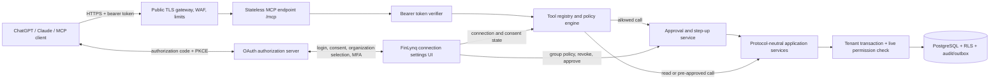

# Remote MCP full-accounting agent plan

Status: dev implementation complete and validated, 2026-09-03; production rollout gates remain  
Scope: remote HTTPS/OAuth access for ChatGPT, Claude, and other conforming MCP clients  
Repository: Business FinLynq

## Implementation snapshot

The dev candidate now implements the protocol, policy, settings, domain adapters, database security, and audit layers described here. With a full-permission test role and both groups enabled in `CONFIRM_WRITES`, the live catalog exposes 61 narrowly scoped tools: 1 shared capability tool, 35 Daily tools, and 25 Setup tools. Setup remains off and Daily remains confirm-per-write on a new connection.

The shipped names use explicit `finlynq_daily_*` and `finlynq_setup_*` prefixes because current client tool pickers benefit from visible grouping. The endpoint is same-origin `/mcp`; OAuth discovery, authorization-code plus PKCE S256, dynamic public-client registration, exact resource binding, hashed opaque credentials, ten-minute access tokens, rotating refresh families, revocation, and server-side approvals are implemented in the application. An independent OAuth/security assessment, load testing, supported-client certification, and staged rollout remain production release gates rather than claims of this dev validation.

## 1. Executive decision

The [document inbox and external storage plan](mcp-document-inbox-2026-09.md) records an extension implemented in source on 2026-09-04: the user's MCP client drives document identification and ingestion in the free offering, with hosted model API processing deferred. Its nine cloud inbox tools extend the catalog described above; provider setup and live client acceptance are documented in the [operations guide](../operations/document-cloud-inbox.md).

Build one public, remote MCP resource server at the configured FinLynQ HTTPS application origin, under `/mcp` (a dedicated MCP hostname can route to the same handler). It exposes two logical, independently configurable tool groups through the same OAuth connection:

1. **Daily accounting** — journals, invoices, bills, receipts, recorded supplier payments, open items, bank activity, reconciliation, and reports.
2. **Setup and master data** — legal entities, ledgers and accounts, account combinations, currencies and rates, tax registrations, customers/suppliers, hierarchies, posting policies, periods, and bank-feed setup.

Do not build two independent MCP servers. A single endpoint avoids duplicate OAuth grants, duplicate connection administration, and awkward workflows in which an agent must cross from a “daily” server to a “setup” server to create a missing supplier or account. The tool registry still assigns every tool to one of the two groups, the connection page controls each group independently, and `tools/list` returns only the intersection the caller may currently use.

Use **delegated user OAuth**, not the dormant organization service-principal design. Each connection represents one FinLynq user acting in one organization. Every call is limited by the user’s live membership and permissions. A token, OAuth scope, MCP group setting, or tool-list result never grants a business permission by itself.

The effective decision for every listed or called tool is:

```text
active user and organization
AND active organization membership
AND current domain permission
AND OAuth consent scope
AND organization MCP policy ceiling
AND connection group mode/per-tool override
AND current business-state and step-up requirements
```

The server must re-evaluate this decision at execution time. Filtering `tools/list` is an agent-usability feature, not an authorization boundary.

Use the official MCP TypeScript SDK v2 and its web-standard HTTP handler. The SDK’s `createMcpHandler` can serve the current stateless 2026 protocol and the stateless 2025-era protocol from one endpoint, which is important because client adoption will not be simultaneous. Pin exact package versions and cover both protocol eras in contract tests.

This is not a thin wrapper over the existing HTTP routes. The browser routes assume cookies, same-origin mutation checks, and browser MFA state. MCP and the UI must instead call the same protocol-neutral application commands and queries, with separate browser-session and OAuth adapters.

## 2. Confirmed product decisions and assumptions

- There is no local/desktop/stdio access. Production access is HTTPS with OAuth only.
- “The agent can do everything” means every accounting operation that exists in FinLynq and that the connected user can perform. It does not mean arbitrary SQL, filesystem access, platform administration, user/role administration, key recovery, or bypassing accounting controls.
- One OAuth connection is bound to one user and one organization. A user who works in several organizations creates a distinct connection for each organization. Tool inputs never accept `organizationId` or `actorId` from the model.
- “Payment” in the current application means recording an accounting settlement. It does not move money at a bank. If payment execution is added later, it receives a separate security design and cannot be silently folded into `supplier_payment.record`.
- Posted records remain immutable. Corrections use reversal, void, replacement, or effective-dated deactivation. Hard delete is never an MCP tool.
- The tool surface covers the application’s present accounting domains. Inventory, payroll, fixed assets, consolidation, and other future modules join through the same registry only after their domain services and permissions exist.
- Connector OAuth grant, bank-provider credential entry, and expansion of a connection’s authority remain human actions in secure FinLynq pages. An agent may initiate these flows and report their status, but secrets must never pass through model context.

## 3. Current repository state

The application already has strong accounting primitives, but its current MCP seam is intentionally dormant and read/draft-only.

| Area | Reusable foundation | Work required for full MCP |
| --- | --- | --- |
| MCP | `src/modules/mcp/policy.ts` has three fail-closed scope mappings and security tests. | Replace the fixed service-principal policy with a declarative, delegated-user tool registry and a real `/mcp` transport. |
| Tenant isolation | `withTenantTransaction` sets organization, actor, request, auth method, and `MCP` source context; PostgreSQL RLS is the tenant boundary. | Introduce a protocol-neutral actor context and add OAuth connection/client provenance. Keep live permission checks inside transactions. |
| Permissions | Domain permissions already cover journals, periods, parties, AR/AP, tax, banking, and reconciliation. | Normalize `mcp.ledger.read` into a channel-neutral `ledger.read`; add granular account/entity/currency/hierarchy/combination and reconciliation-finalize permissions rather than overloading broad settings permissions. |
| Posting | All posted journals go through `postJournalInTransaction`; posted records are immutable and reversal-aware. | Migration `0004_security_hardening.sql` currently blocks all MCP/IMPORT posting at the database trigger. Replace the MCP blanket ban with current-user permission and MCP policy enforcement without weakening the single posting boundary. Keep import posting blocked unless separately redesigned. |
| Journals | Create, post, and reverse services exist with exact money, idempotency, content hashes, period rules, and permissions. | Add first-class submit and approve commands. Decide and enforce self-approval/segregation-of-duties policy. MCP journal creation must use origin `MCP`, while explicit post remains possible when authorized. |
| AR/AP | Draft/create/edit, issue/post, receipt/payment settlement, and void/reversal services exist. | Extract stable public DTOs and queries from UI-oriented workspace loaders; preserve owner-module correction routing. |
| Parties | Create party, optionally create a customer/supplier account, add another account, and exact-name search exist. Sensitive fields are encrypted. | Add paginated search plus update, effective-date/deactivate, address maintenance, and party-account update/deactivate services. |
| Chart of accounts | Account tables, combinations, validation, hierarchies, and onboarding seed logic exist. | There is no runtime GL-account create/update/deactivate application service. This is a blocking gap for a full setup agent. Add it before exposing account setup tools. |
| Configuration | Entity creation, currencies, FX rates, tax registration, segments, segment values, combinations, hierarchies, posting policy, and period transition services exist. | Remove browser-session coupling, add missing update/deactivate commands, and translate recent-MFA requirements into OAuth assurance or FinLynq approval receipts. |
| Banking | Connect/reauthorize/disable SimpleFin, sync, map accounts, create/version rules, create/match/unmatch reconciliations, and submit/review/finalize/void exist. | Never accept provider secrets in tool arguments. Add secure browser handoff for connect/reauthorize and stable read/query DTOs. Consider splitting finalize from review permission. |
| Reporting | Trial balance, balance sheet, profit and loss, account inquiry, accounting overview, tax determinations, dimensions, and CSV generation exist. | Extract browser-independent query services, add pagination/export limits, stable schemas, and point-in-time metadata. |
| OAuth | Browser cookie sessions, MFA, step-up, and revocation exist. | No MCP OAuth authorization/resource server is implemented. This is a new security subsystem and should use a proven OAuth/OIDC provider or audited library, not hand-built protocol or cryptography. |

The new architecture supersedes the MCP restrictions in `docs/architecture/001-foundation.md`, Phase 8 of `docs/plan/codex-implementation-plan.md`, and R4-03 of `docs/plan/product-implementation-work-order-2026-08.md`. Those documents currently prohibit MCP posting, approval, period reopen, and settlements. Before implementation, accept a security/accounting ADR that explicitly replaces those channel-wide prohibitions with delegated-user authorization, configurable MCP policy, and approval controls. Hard deletion and security administration remain excluded.

## 4. Target architecture



### 4.1 Deployment shape

- Route all production MCP traffic through `mcp.business.finlynq.com`; no stdio listener and no localhost transport in production.
- Initially mount the MCP SDK’s web-standard handler in the existing Node/Next deployment so it can call application services directly. Isolate it at the reverse proxy with a dedicated host, request-body limits, rate limits, timeouts, and logs.
- Keep protocol, policy, and domain layers separate so the MCP adapter can later move to its own process without moving accounting logic or granting direct repository access.
- Prefer JSON responses. Use request-scoped SSE only when a supported client and a genuinely long operation need progress. Do not introduce sticky MCP sessions.
- Use a durable job plus `finlynq.operations.get` for work that cannot reliably complete within the gateway timeout. Do not depend on the new MCP Tasks extension until both target clients support it.
- Do not make prompts or MCP resources essential to correct use: Anthropic’s current remote connector surface is tool-focused. Put required instructions in tool descriptions, strict schemas, and structured results.

### 4.2 Application boundary

Create a channel-neutral context, for example:

```ts
type ActorContext = Readonly<{
  organizationId: string;
  actorId: string;
  membershipId: string;
  requestId: string;
  sourceSurface: "UI" | "API" | "IMPORT" | "WORKER" | "MCP";
  authMethod: string;
  delegatedConnectionId?: string;
  oauthClientId?: string;
  authenticationTime?: Date;
  assuranceLevel?: string;
  reason?: string;
}>;
```

Browser-session code and OAuth code each create this context from trusted server-side state. The model never supplies identity, tenant, scope, assurance, or group mode. Commands continue to call `assertWritableOrganization`, live permission checks, the posting engine, audit/outbox code, encryption services, exact-money validation, and rate limits.

Protocol adapters may validate and map DTOs, but may not contain journal construction, tax decisions, posting rules, reconciliation math, permission shortcuts, or direct SQL.

## 5. OAuth, tenant binding, and current-user authorization

### 5.1 Required OAuth flow

Implement the MCP OAuth 2.1 authorization-code flow with PKCE `S256`:

1. An unauthenticated request to the MCP endpoint returns a Bearer challenge pointing to protected-resource metadata.
2. The MCP resource server publishes `/.well-known/oauth-protected-resource` with the exact MCP resource URL and authorization-server location.
3. The authorization server publishes OAuth/OIDC discovery metadata and supports Client ID Metadata Documents (CIMD) as the preferred client identity mechanism.
4. Support pre-registered clients where useful and Dynamic Client Registration only as a compatibility fallback. Rate-limit and validate remote metadata/registration to prevent SSRF and registration abuse.
5. The user signs in to FinLynq, completes MFA when required, selects exactly one active organization membership, sees both requested tool groups and their modes, and consents.
6. The authorization server issues a short-lived, audience-bound access token and a rotating refresh token. ChatGPT does not support a machine-to-machine/service-account grant for this connection model, so client credentials are not the primary path.
7. The MCP resource server validates signature or introspection result, issuer, exact audience/resource, expiry/not-before, client identity, token status, scopes, user, organization, membership, and connection status before dispatch.

Recommended scope ceiling:

```text
mcp:daily:read
mcp:daily:write
mcp:setup:read
mcp:setup:write
offline_access          # optional, only when the client supports refresh
```

These scopes express user consent and token limits; they do not duplicate domain RBAC. For example, `mcp:daily:write` plus `ledger.journal.post` is required to post a journal. Possessing only the OAuth scope never grants posting.

### 5.2 Token and connection rules

- Bind each authorization code, access token, refresh token, approval receipt, and connection record to one `user_id`, `membership_id`, `organization_id`, `client_id`, and exact MCP resource.
- Prefer access-token lifetime of 5–10 minutes. Rotate refresh tokens on every use, detect reuse, and revoke the token family on reuse.
- Revoke or immediately deny when the user, organization, membership, OAuth connection, or relevant group is disabled. Role changes take effect on the next tool list and next tool call even if the access token remains valid.
- Do not embed a durable list of business permissions in the token. Claims may identify the user, membership, organization, connection, scopes, client, authentication time, and assurance level; the database remains authoritative for permissions.
- Do not accept organization switching through a tool parameter or a free-form header. Reconnect for a different organization.
- Do not pass the incoming bearer token to another service. Mint a narrowly scoped internal assertion if a future split-service deployment needs one.
- Store only token hashes where the application must store tokens. Keep signing keys and provider secrets outside the database and normal environment files, with rotation and key identifiers.
- Log authentication failures in the security event stream without logging bearer tokens, authorization codes, refresh tokens, provider credentials, or full tool arguments.

### 5.3 Authorization server decision gate

Do not implement an authorization server from scratch inside a Next route. In the first work package, evaluate a mature OAuth/OIDC provider or audited server library against these non-negotiable requirements:

- OAuth 2.1 authorization code + PKCE `S256`;
- exact resource indicators/audience binding;
- protected-resource and authorization-server metadata;
- CIMD support or an extension point to validate CIMD, plus pre-registration/DCR compatibility;
- refresh rotation, revocation, JWKS rotation, `auth_time`/ACR, and step-up;
- integration with the existing FinLynq login/MFA and organization selector;
- tenant-aware consent text and per-connection revocation;
- no requirement to copy FinLynq roles into the provider.

Record the selected product/library and threat model in the ADR. The MCP resource server remains responsible for current FinLynq membership, permission, group, and business-state checks regardless of provider choice.

## 6. Two configurable tool groups

Each connection stores one mode for each group:

| Mode | `tools/list` behavior | Write-call behavior |
| --- | --- | --- |
| `OFF` | Group tools are absent. | Deny. |
| `READ_ONLY` | Only authorized read tools are listed. | Deny even if the OAuth token has a write scope. |
| `CONFIRM_WRITES` | Authorized reads and writes are listed. | Reads run; writes require a server-side approval receipt unless a stricter per-tool rule denies them. |
| `ALLOW_WRITES` | Authorized reads and writes are listed. | Writes run without a FinLynq approval receipt, subject to current RBAC, OAuth scopes, organization policy, tool override, amount/risk thresholds, and business validation. |

Recommended defaults are `CONFIRM_WRITES` for Daily Accounting and `OFF` for Setup and Master Data. An authorized user can change either connection setting within the organization’s policy ceiling. Increasing OAuth scopes requires reauthorization; reducing or disabling authority takes effect immediately. Setup `ALLOW_WRITES` should be time-boxable and should require recent MFA when enabled.

Add advanced per-tool overrides with `INHERIT`, `DENY`, `CONFIRM`, and `ALLOW`. Organization policy is a ceiling: a connection owner can choose less authority but cannot override an organization-wide deny or mandatory-confirm rule. Changing organization-wide MCP policy requires the appropriate organization permission and fresh MFA.

### 6.1 Portable approval behavior

Client-side approval controls are useful but are not consistent enough to be the server’s only policy. When FinLynq policy requires confirmation:

1. Validate authorization, schema, references, concurrency version, and business preconditions without mutating.
2. Create a short-lived approval request bound to the connection, user, organization, tool name, canonical arguments hash, idempotency key, and human-readable effect summary.
3. Return a structured `APPROVAL_REQUIRED` tool error with `approval_id`, `expires_at`, and an HTTPS FinLynq approval URL.
4. The user approves or denies in FinLynq, completing MFA if needed.
5. The agent retries the same tool with the same arguments and idempotency key. The server consumes the matching approval once and executes.

Never expose an MCP tool that approves its own pending action. For the 2026 protocol, `input_required` may later improve the interaction, but the approval-record path remains the compatibility baseline for 2025-era clients.

## 7. Tool catalog

Names follow `finlynq.<group-or-shared>.<domain>.<verb>`. Keep names stable; add fields compatibly; introduce a new tool version only for a breaking contract. The tables describe the target v1 catalog. “Adapter” means the domain behavior exists but needs a stable command/query DTO and MCP wrapper. “Gap” means a domain service must be built first.

### 7.1 Shared discovery tools

Shared read tools appear when at least one group is enabled and the user has the corresponding read permission.

| Tool | Purpose | Readiness |
| --- | --- | --- |
| `finlynq.context.get` | Return the connected user/organization label, enabled groups, effective capabilities, entities, ledgers, currencies, and safe defaults. Never return tokens or internal roles. | New composed query |
| `finlynq.accounts.search` | Paginated search of active/effective accounts and account combinations, including stable IDs and display keys. | Extract query |
| `finlynq.entities.list` | List legal entities, ledgers, periods, functional currencies, and writable state. | Extract query |
| `finlynq.parties.search` | Paginated customer/supplier search by safe filters; return accounts and stable IDs according to permission. | Partial; general search gap |
| `finlynq.operations.get` | Read an authorized asynchronous export/sync job by opaque ID. The ID is not a capability; reauthorize every read. | New job infrastructure |

### 7.2 Daily accounting tools

| Tool(s) | Required domain permission | Risk/default | Readiness |
| --- | --- | --- | --- |
| `finlynq.daily.journals.search`, `.get` | `ledger.read` (new normalized permission) | Read | Extract current workspace queries |
| `finlynq.daily.journal.create` | `ledger.journal.draft` | Routine write | Adapter |
| `finlynq.daily.journal.submit` | `ledger.journal.submit` | Consequential | Gap: command/service |
| `finlynq.daily.journal.approve` | `ledger.journal.approve` | Consequential; honor segregation rules | Gap: command/service |
| `finlynq.daily.journal.post` | `ledger.journal.post`, plus adjustment permission when applicable | Consequential; confirm by default | Adapter plus database-policy migration |
| `finlynq.daily.journal.reverse` | `ledger.journal.reverse` | Consequential; reason required | Adapter |
| `finlynq.daily.documents.search`, `.get` | Receivables/payables read permission selected by document kind | Read | Extract current queries |
| `finlynq.daily.invoice.create`, `.update` | `receivables.manage` | Routine write | Adapter |
| `finlynq.daily.invoice.issue` | `receivables.post` | Consequential; posts and opens receivable | Adapter |
| `finlynq.daily.invoice.void` | `receivables.void` | Consequential; reason required | Adapter |
| `finlynq.daily.receipt.record` | `receivables.settle` | Consequential; records settlement, does not move money | Adapter |
| `finlynq.daily.receipt.void` | `receivables.void` | Consequential; exact reversal | Adapter |
| `finlynq.daily.bill.create`, `.update` | `payables.manage` | Routine write | Adapter |
| `finlynq.daily.bill.issue` | `payables.post` | Consequential; posts and opens payable | Adapter |
| `finlynq.daily.bill.void` | `payables.void` | Consequential; reason required | Adapter |
| `finlynq.daily.supplier_payment.record` | `payables.settle` | Consequential; records settlement, does not move money | Adapter |
| `finlynq.daily.supplier_payment.void` | `payables.void` | Consequential; exact reversal | Adapter |
| `finlynq.daily.open_items.search` | Matching AR/AP read permission | Read | Extract current query |
| `finlynq.daily.bank_transactions.search` | `banking.read` | Read | Extract banking workspace query |
| `finlynq.daily.bank_sync.start` | `banking.sync` | External action; rate-limited | Adapter; may return operation ID |
| `finlynq.daily.reconciliation.get` | `banking.read` | Read | Extract query and proof DTO |
| `finlynq.daily.reconciliation.create` | `banking.reconcile.prepare` | Routine write | Adapter |
| `finlynq.daily.reconciliation.match`, `.unmatch` | `banking.reconcile.prepare` | Routine write with exact allocation/concurrency rules | Adapter |
| `finlynq.daily.reconciliation.submit` | `banking.reconcile.prepare` | Consequential | Adapter over transition service |
| `finlynq.daily.reconciliation.review` | `banking.reconcile.review` | Consequential; fresh assurance by policy | Adapter over transition service |
| `finlynq.daily.reconciliation.finalize` | New `banking.reconcile.finalize` | Consequential; immutable proof | Permission split plus adapter |
| `finlynq.daily.reconciliation.void` | New `banking.reconcile.void` or state-derived existing permission | Consequential; reason required; finalized sessions stay immutable | Permission cleanup plus adapter |
| `finlynq.daily.report.run` | Domain read permission for report type | Read; bounded structured result | Refactor reporting queries |
| `finlynq.daily.report.export` | Domain read permission for report type | Read/external artifact; formula-safe export | New bounded async/signed-download adapter |

The report tool uses a strict `report_type` enum for trial balance, balance sheet, profit and loss, account inquiry, accounting overview, and tax determinations. These operations share permission/risk shape and can safely use one discriminated schema. Return `generated_at`, `data_as_of`, applied filters, currency/basis, rows, totals, and trace identifiers. Paginate detailed reports and return short-lived same-origin signed downloads for large exports.

### 7.3 Setup and master-data tools

| Tool(s) | Required domain permission | Risk/default | Readiness |
| --- | --- | --- | --- |
| `finlynq.setup.configuration.get` | Relevant settings/read permissions | Read | Refactor current configuration DTO |
| `finlynq.setup.entity.create` | New `ledger.entities.manage` | Consequential | Existing behavior; permission/refactor |
| `finlynq.setup.entity.update`, `.deactivate` | `ledger.entities.manage` | Consequential; no delete | Gap |
| `finlynq.setup.account.create`, `.update`, `.deactivate` | New `ledger.accounts.manage` | Consequential; control accounts stricter | Blocking gap |
| `finlynq.setup.segment.configure` | `ledger.segments.manage` | Consequential | Adapter |
| `finlynq.setup.segment_value.create`, `.update`, `.deactivate` | `ledger.segments.manage` | Consequential | Create exists; update/deactivate gaps |
| `finlynq.setup.account_combination.create`, `.deactivate` | New `ledger.account_combinations.manage` | Consequential; effective-dated replacement | Create exists; deactivate gap |
| `finlynq.setup.party.create` | `parties.manage` | Routine write; duplicate check required | Adapter |
| `finlynq.setup.party.update`, `.deactivate` | `parties.manage` | Consequential; encrypted fields/effective dates | Gap |
| `finlynq.setup.party_account.add`, `.update`, `.deactivate` | `parties.manage` | Consequential; validate AR/AP control account | Add exists; update/deactivate gaps |
| `finlynq.setup.currency.set` | New `ledger.currencies.manage` | Consequential | Existing behavior; permission/refactor |
| `finlynq.setup.exchange_rate.record` | New `ledger.fx_rates.manage` | Consequential; source/effective time required | Existing behavior; permission/refactor |
| `finlynq.setup.tax_registration.create`, `.update`, `.end` | New `ledger.tax_registrations.manage` | Consequential; evidence required | Create exists; update/end gaps |
| `finlynq.setup.hierarchies.list`, `.get` | Ledger/settings read | Read | Adapter |
| `finlynq.setup.hierarchy.create`, `.update`, `.publish` | New `ledger.hierarchies.manage` | Draft writes routine; publish consequential | Adapter and permission refinement |
| `finlynq.setup.posting_policy.set` | `ledger.posting_policy.manage` | Consequential; expected version and reason | Adapter |
| `finlynq.setup.period.close`, `.reopen`, `.seal` | Existing close/reopen/seal permission | Consequential; expected version and reason | Adapter; always honor pending-journal checks |
| `finlynq.setup.bank_connections.list` | `banking.read`/connection manage | Read | Extract query |
| `finlynq.setup.bank_connection.begin`, `.reauthorize` | `banking.connections.manage` | Human handoff; model never sees provider secret | New secure handoff over existing services |
| `finlynq.setup.bank_connection.disable` | `banking.connections.manage` | Consequential | Adapter |
| `finlynq.setup.bank_account.map` | `banking.connections.manage` | Consequential; active asset/non-control combination only | Adapter |
| `finlynq.setup.bank_rule.create`, `.set_state` | `banking.rules.manage` | Consequential; rules only suggest/manual review under current design | Adapter |

Do not combine different side effects into a generic `execute`, `manage`, `update_anything`, REST proxy, or SQL tool. Create/update may share internal code, but posting, approval, voiding, publishing, finalizing, and deactivation remain distinct tools because they have different permissions, confirmation needs, and accounting consequences.

## 8. Preventing agent confusion

The final registry is intentionally comprehensive, but a model should rarely receive the whole catalog.

1. **Server-side dynamic catalog:** `tools/list` is deterministic and returns only tools allowed by the presented OAuth scopes, live domain permissions, enabled group modes, and per-tool denies. Setup is off by default.
2. **Two clear namespaces:** every write is visibly under `finlynq.daily` or `finlynq.setup`; shared tools are read-only discovery.
3. **Client filtering:** publish recommended allowlists. OpenAI callers can use `allowed_tools`; Claude callers can disable or defer tools and use tool search. Treat these as performance/selection aids, not security.
4. **Goal-oriented tools:** names and descriptions use accounting language the user will use, not route names or table names. Each description says when to use the tool, when not to use it, prerequisites, side effect, and correction path.
5. **Separate reads from writes and consequences:** never hide a post/void/finalize behind an `action` string in a broad tool when a distinct permission or confirmation applies.
6. **Strict schemas:** JSON Schema 2020-12, `additionalProperties: false`, exact enums, documented ISO dates, exact decimal strings rather than binary floats, bounded strings/arrays, and stable UUID inputs obtained from discovery tools.
7. **No tenant guessing:** omit organization and user identifiers from inputs. Return stable entity, ledger, account-combination, party-account, document, open-item, journal, and reconciliation IDs for follow-up calls.
8. **Small results:** cursor pagination, explicit result limits, summaries plus IDs, no entire-ledger dumps, and signed exports for large reports.
9. **Structured recovery:** results contain `next_actions` only from a server-owned enum and only when currently authorized. Business errors say what prerequisite is missing without leaking inaccessible resource existence.
10. **Evals before adding tools:** a new tool must improve a defined accounting use case and pass selection-confusion tests against similarly named tools.

Do not depend on a long system prompt to teach workflows. A connector-specific skill can improve ChatGPT behavior, but tool contracts must be sufficient for clients that receive only MCP tools.

### 8.1 Cross-group workflow example

For “record and issue this supplier bill, creating the supplier if necessary”:

1. `context.get` establishes the bound organization, entity/ledger defaults, group modes, and effective capabilities.
2. `parties.search` resolves the supplier and its supplier account.
3. If missing, `setup.party.create` is available only when Setup is enabled, consented, and the current user has `parties.manage`. Otherwise the agent returns the exact missing capability and does not improvise an ID.
4. `accounts.search` resolves expense, tax, and AP mappings; setup creates missing allowed master data only when authorized.
5. `daily.bill.create` creates an idempotent draft.
6. `daily.bill.issue` posts it only if current permission, group policy, OAuth scope, approval, period, tax, and account validation all pass.

Every step is independently authorized. A handle from an earlier step is an identifier, not a capability.

## 9. Tool execution contract

### 9.1 Request rules

- Generate a server request ID for every HTTP request and accept a caller correlation ID only as untrusted metadata.
- Require an `idempotency_key` for every mutation. Bind it to organization, tool, actor/connection, and a canonical command hash. Exact replays return the original result; changed arguments return `IDEMPOTENCY_CONFLICT`.
- Require `expected_version`, `expected_revision`, or `expected_content_hash` for edits and consequential transitions where a stale decision matters.
- Require a durable reason for reverse, void, reopen, close/seal, policy changes, deactivation, and other control actions.
- Keep each tool call atomic. Multi-tool workflows are not one database transaction; use compensating reversal/void semantics rather than trying to hold a transaction across model turns.
- Reuse existing exact-money and currency validation. Never accept JavaScript numbers for monetary values or exchange rates.
- Never fetch arbitrary URLs from tool arguments or accounting text. Provider and export URLs must be generated server-side from allowlisted destinations.

### 9.2 Result envelope

Every success returns a concise text summary and matching `structuredContent`, validated against an output schema:

```json
{
  "ok": true,
  "request_id": "...",
  "data": {},
  "idempotent_replay": false,
  "warnings": [],
  "next_actions": []
}
```

Tool-execution failures return `isError: true` with a stable structured code and a safe, actionable message. Reserve JSON-RPC protocol errors for malformed MCP messages and unknown tools. Initial error taxonomy:

- `AUTHENTICATION_REQUIRED`, `TOKEN_INVALID`, `TOKEN_EXPIRED`;
- `OAUTH_SCOPE_REQUIRED`, `MEMBERSHIP_INACTIVE`, `PERMISSION_DENIED`, `GROUP_DISABLED`, `TOOL_DENIED`;
- `STEP_UP_REQUIRED`, `APPROVAL_REQUIRED`, `APPROVAL_EXPIRED`, `APPROVAL_MISMATCH`;
- `VALIDATION_FAILED`, `REFERENCE_NOT_FOUND`, `BUSINESS_PRECONDITION_FAILED`;
- `VERSION_CONFLICT`, `IDEMPOTENCY_CONFLICT`, `INVALID_STATE_TRANSITION`;
- `RATE_LIMITED`, `WRITE_DISABLED`, `DEPENDENCY_UNAVAILABLE`, `INTERNAL_ERROR`.

Never return stack traces, SQL, ciphertext, blind indexes, tokens, provider secrets, internal hostnames, or raw authorization details.

## 10. Database and model changes

Add tenant-isolated, RLS/FORCE-protected tables or equivalent provider-backed records for:

- `oauth_connections`: user, membership, organization, client identity, granted scopes, status, created/last-used/revoked timestamps, safe client display metadata;
- `mcp_connection_group_policies`: one row per connection/group with mode, version, optional expiry and limits;
- `mcp_tool_policy_overrides`: explicit deny/confirm/allow overrides;
- `mcp_approval_requests`: tool, canonical argument hash, idempotency key, effect summary, status, expiry, approver, assurance, one-time consumption;
- `mcp_async_operations`: authorized job type/status/result reference/expiry;
- security events for authentication, authorization denials, policy changes, connection revocation, and refresh-token reuse.

If the selected authorization server owns codes and tokens, do not duplicate raw OAuth credential tables in the application. Store only the FinLynq connection link and provider subject/client references needed for policy, audit, and revocation.

Extend transaction/audit provenance with the OAuth connection and client identifiers. Accounting audit events continue to identify the FinLynq user as the actor, with the MCP connection/client recorded as delegated identity and `source_surface = MCP`. Emit an audit/outbox pair for successful business mutations through the same domain path used by the UI. Log denied attempts in security events, not the immutable business ledger audit chain.

The database posting migration must remove only the blanket `MCP` branch from `app.validate_journal_posting`; do not remove permission, period, balance, journal-type, content-hash, or tenant checks. Add a database integration test proving `IMPORT` still cannot post, an authorized MCP user can post through the service, and direct/unauthorized MCP updates fail.

## 11. Security and accounting controls

- **Live delegated RBAC:** use `actorHasActivePermission` inside the business transaction. Never create an all-powerful “MCP role,” and do not treat the old `INTEGRATION_MCP` template as the connected user.
- **Least authority:** OAuth scope, organization ceiling, connection mode, and per-tool rule can only remove authority from the user’s current role.
- **Separation of duties:** the agent is the connected user, not an independent approver. If a workflow requires another actor, return the pending state and required permission; never simulate a second user. Add explicit self-approval policy before journal approval tools ship.
- **Immutable accounting:** posting/issue/finalize results are immutable; corrections are linked and fully audited.
- **Prompt-injection containment:** treat party names, invoice descriptions, memos, bank descriptions, attachment text, and imported content as untrusted data. Label it as data in outputs, strip control characters, never interpret embedded instructions, and never allow it to choose URLs, tools, scopes, or policy.
- **Data minimization:** tools return only fields required for the accounting goal. Sensitive party/bank/tax fields require their normal domain permissions and should be masked when full values are unnecessary.
- **No secret handling by models:** bank setup tokens, passwords, MFA codes, OAuth codes/tokens, encryption material, and API keys never appear in tool inputs/results. Use a one-time, same-origin secure handoff page.
- **Network controls:** TLS only, exact Host/Origin policy, proxy request limits, correct `Forwarded` trust configuration, no open redirects, no arbitrary callback URLs, no bearer token in query strings, and outbound allowlists/SSRF protection.
- **Rate and abuse controls:** limit by IP before auth and by organization/user/connection/tool after auth; separate reads, writes, reports, bank sync, and failed authorization buckets. Bound concurrency and result size.
- **Kill switches:** global MCP off, organization MCP off, group off, connection revoke, client deny, individual tool deny, and write-only disable. They take effect without waiting for token expiry.
- **Availability boundary:** MCP failure must not affect UI accounting. Circuit-break external bank calls; keep database timeouts; return retriable errors without replaying completed mutations.

## 12. Implementation work order

Sizes are relative engineering effort, not calendar commitments. A production implementation is an XL program, not one endpoint: roughly 18–30 engineer-weeks before external GA, depending on the OAuth provider and how much missing master-data functionality is included. Security and accounting review are part of the work, not post-release polish.

### WP0 — ADR, use cases, and threat model (M)

Deliverables:

- accept the delegated-user, one-organization-per-connection, two-group architecture;
- define “all accounting” and record the security/admin exclusions;
- supersede the old read/draft-only MCP decisions;
- select the OAuth authorization-server approach;
- threat-model token theft, confused deputy, cross-tenant IDs, scope escalation, malicious document text, approval replay, duplicate posting, stale permissions, SSRF, and client-registration abuse;
- approve the target tool catalog and domain-permission additions.

Exit gate: security and accounting reviewers sign the ADR and tool/risk matrix.

### WP1 — Stable application-service contracts (XL)

Deliverables:

- introduce `ActorContext` and browser/OAuth adapters;
- remove `SessionPrincipal` and redirect coupling from domain commands/queries;
- create versioned DTOs, cursor pagination, error taxonomy, optimistic concurrency, and idempotency contract;
- extract reports, registers, account lookup, party lookup, open items, and banking reads from workspace/UI loaders;
- add GL-account CRUD/deactivation, party maintenance, entity maintenance, segment-value maintenance, tax-registration maintenance, combination deactivation, journal submit/approve, and permission refinements;
- preserve one posting service and UI/API/MCP behavior equivalence tests.

Exit gate: protocol adapters require no accounting SQL or business rules; UI regression suite remains green.

### WP2 — OAuth and connection policy (XL)

Deliverables:

- OAuth protected-resource/discovery/authorization integration with PKCE, CIMD, compatibility registration, audience binding, refresh rotation, and revocation;
- organization selection and consent screens showing Daily and Setup scopes/modes;
- connection administration page with modes, per-tool overrides, last used, revoke, and emergency organization disable;
- policy engine implementing the full intersection formula;
- approval request/receipt and MFA step-up integration;
- provenance, security events, redaction, and operational runbooks.

Exit gate: OAuth conformance and abuse tests pass; revoked/changed permissions deny on the next call.

### WP3 — MCP transport and read surface (L)

Deliverables:

- official SDK v2 `createMcpHandler` at `/mcp`, serving modern 2026 and stateless 2025 clients;
- authentication middleware in front of the SDK handler;
- declarative registry with group, scopes, permission resolver, risk, schemas, handler, and version metadata;
- deterministic authorization-filtered `tools/list` with private/user cache semantics;
- shared discovery, daily reads, setup reads, reporting, pagination, result limits, and structured errors;
- OpenAI and Anthropic staging smoke tests.

Exit gate: read-only pilot demonstrates no cross-organization disclosure and acceptable tool-selection accuracy.

### WP4 — Daily accounting mutations (XL)

Deliverables:

- journals including submit/approve/post/reverse;
- invoices, bills, receipts, recorded supplier payments, issue/post, void/reversal;
- bank sync and full reconciliation workflow;
- approval/idempotency/concurrency handling for every mutation;
- carefully scoped database migration replacing the MCP posting ban;
- group settings and client allowlist presets for daily bookkeeping and month-end.

Exit gate: UI and MCP produce equivalent journal/subledger/audit outcomes, and retry/concurrency tests prove no duplicate economic event.

### WP5 — Setup and master-data mutations (XL)

Deliverables:

- accounts, entities, combinations, segments, currencies/rates, tax registrations, parties/accounts, hierarchies, posting policy, periods, and banking setup tools;
- secure human handoff for bank credentials and reauthorization;
- effective dating/deactivation instead of deletion;
- stronger confirmation defaults and time-boxed Setup autonomy;
- cross-group end-to-end scenarios where the agent creates a missing prerequisite then completes the daily transaction.

Exit gate: every setup tool has a domain permission, audit event, idempotency or optimistic-concurrency rule, correction/deactivation path, and accounting-owner review.

### WP6 — Hardening, evals, and staged release (L/XL)

Deliverables:

- security review, penetration test, OAuth mix-up/SSRF/replay suite, and prompt-injection red-team;
- load/capacity tests for tool listing, reports, sync, token verification, and database pools;
- dashboards, alerts, audit views, revocation/runbook drills, backup/restore coverage for new tables;
- version/deprecation policy and connector setup guides;
- staged rollout and rollback/kill-switch rehearsal.

Exit gate: the release gates in the next section are met in production-like staging.

## 13. Test and evaluation plan

### 13.1 Automated security and protocol tests

- valid/invalid OAuth discovery, PKCE downgrade, redirect mismatch, issuer mix-up, wrong audience/resource, missing scope, expired/not-yet-valid token, JWKS rotation, refresh reuse, revoked connection, and disabled membership;
- CIMD/DCR metadata validation, SSRF targets, redirect URI exactness, client impersonation, and registration rate limits;
- cross-organization IDs in every input field and opaque operation/approval IDs;
- role removed between `tools/list` and `tools/call`, group disabled between validation and commit, and organization writes disabled during execution;
- approval hash mismatch, expiry, double consumption, different connection/user, and changed command after approval;
- duplicate/reordered/retried MCP requests, concurrency races, expected-version conflicts, and idempotency conflicts;
- malformed JSON-RPC, invalid schema, oversized body/result, cancellation, timeout, and both 2025/2026 protocol paths.

### 13.2 Accounting equivalence tests

For every mutation, execute the same command through UI/API and MCP adapters and compare:

- domain result and status;
- journal lines, exact debit/credit and transaction/functional amounts;
- tax snapshots, open items, allocations, reconciliation proof, and correction links;
- permission and period behavior;
- audit actor, delegated identity, source surface, request lineage, and outbox event;
- idempotent replay result.

Include negative fixtures for closed/adjustment-only periods, control-account misuse, stale FX/tax evidence, inactive party/account/combination, unbalanced journals, over-allocation, unbalanced reconciliation, and attempts to modify posted/finalized records.

### 13.3 Agent-behavior evals

Run the same corpus through supported ChatGPT and Claude integrations with realistic permissions and group modes:

- answer a trial-balance question without selecting a write tool;
- create a balanced journal and stop at draft when posting is unavailable;
- create and issue an invoice with an existing customer;
- create a missing supplier only when Setup is enabled, then create/issue a bill;
- record partial/multi-item receipts and supplier payments without exceeding open balances;
- reconcile one-to-one, one-to-many, many-to-one, and partial matches, then submit/review/finalize according to role;
- refuse or request approval for a tool disabled by policy;
- handle a permission revoked mid-conversation;
- distinguish recorded settlement from real fund movement;
- produce reports with correct filters and no invented accounts/parties;
- ignore malicious instructions embedded in descriptions, memos, party names, bank text, or imported content.

Minimum release targets:

- zero unauthorized or cross-tenant successful calls in the security suite;
- zero duplicate economic events under retry/concurrency tests;
- 100% of consequential mutations identify their effect, status, IDs, and correction path;
- at least 98% correct first-tool selection on the curated corpus, with 100% no unintended writes;
- no secrets, stack traces, SQL, or unmasked protected fields in captured tool traffic/logs.

## 14. Observability and operations

Measure by client, connection, organization, tool, group, outcome, and latency without logging financial payloads:

- OAuth discovery/token failures and refresh reuse;
- tool-list count and cache behavior;
- calls, success, safe error code, approval-required/approved/denied/expired, and idempotent replay;
- permission/group/policy denials;
- report rows/bytes and asynchronous operation duration;
- bank-provider latency/failure and circuit-breaker state;
- database timeouts, pool pressure, audit/outbox lag, and kill-switch state.

Provide runbooks for compromised connection, client denylisting, signing-key/JWKS rotation, OAuth-provider outage, accidental autonomous policy enablement, suspected cross-tenant access, duplicate-command investigation, and complete organization-wide MCP shutdown. Connection administration must show last used, client identity, organization, scopes, group modes, pending approvals, and revoke controls.

## 15. Rollout

1. Internal read-only connections; both write modes unavailable.
2. Selected organizations with Daily `CONFIRM_WRITES`; Setup off.
3. Daily `ALLOW_WRITES` for explicit pilot users, with limits and instant revoke.
4. Setup `CONFIRM_WRITES`; validate cross-group workflows and master-data corrections.
5. Time-boxed Setup `ALLOW_WRITES` where organization policy permits.
6. External GA only after the security/accounting gates, client compatibility matrix, and rollback drills pass.

Roll out tools behind server-side registry flags. Adding a tool never silently makes it available to existing connections: it must be assigned a group/scope/permission/risk and must respect the connection’s “new tools” policy. Recommended default is that newly added write tools require explicit review before appearing on existing connections.

## 16. Principal risks and mitigations

| Risk | Mitigation |
| --- | --- |
| Token has broader authority than the user now has | Keep scopes coarse and permission-subtractive; check live membership/permission inside every business transaction. |
| Agent sees too many similar tools | Two groups, setup off by default, dynamic listing, stable namespaces, client allowlists/deferred loading, distinct consequential tools, and selection evals. |
| Prompt injection in accounting content causes a write | Treat stored/imported text as data, no arbitrary URLs or generic execution tool, confirmation policy, strict schemas, and red-team tests. |
| Retry creates duplicate financial records | Required idempotency keys, canonical command hashes, locks, optimistic concurrency, exact replay responses, and duplicate-event tests. |
| MCP bypasses accounting controls | Adapter-only architecture; all writes use existing domain services, tenant transaction, permissions, posting engine, audit/outbox, and RLS. |
| OAuth implementation becomes the weakest component | Mature provider/audited library, security review, conformance tests, short tokens, refresh rotation, audience binding, and kill switches. |
| Setup automation damages master data | Off-by-default group, stronger defaults, time-boxed autonomy, effective-dated deactivation, expected versions, previews/approval summaries, and audit. |
| Client approval behavior differs | Enforce FinLynq policy server-side with portable approval receipts; use client approvals only as an additional layer. |
| A “payment” tool is mistaken for bank transfer | Use `supplier_payment.record`, state “does not move money” in name/description/result, and design future payment execution separately. |
| Protocol/client versions diverge | Official SDK v2, one endpoint serving 2025/2026 eras, pinned versions, compatibility tests, and no reliance on optional tasks/resources/prompts. |

## 17. Definition of done

The initiative is complete only when:

- ChatGPT and Claude can connect to the public HTTPS endpoint through OAuth without local setup;
- one connection is visibly bound to one current FinLynq user and organization;
- Daily and Setup modes can be changed and revoked independently, with changes effective immediately;
- the tool list and every call honor live user permissions plus OAuth/group/tool policy;
- the complete catalog for implemented FinLynq accounting domains is available, including the identified missing services;
- authorized MCP posting, settlements, reversals, period controls, master-data setup, reconciliation, and reporting use the same accounting paths as the UI;
- no MCP tool can hard-delete accounting data, administer identities/roles/recovery, accept secrets, run arbitrary SQL, or move money under the guise of recording a settlement;
- security, accounting equivalence, agent selection, compatibility, load, audit, backup, revocation, and rollback gates pass;
- old read/draft-only architecture documents are updated by an accepted ADR and operational documentation is current.

## 18. Authoritative references

Research was checked on 2026-09-02. Use current primary documentation during implementation because MCP and connector behavior are evolving.

- [MCP 2026-07-28 Streamable HTTP transport](https://modelcontextprotocol.io/specification/2026-07-28/basic/transports/streamable-http)
- [MCP 2026-07-28 authorization](https://modelcontextprotocol.io/specification/2026-07-28/basic/authorization)
- [MCP 2026-07-28 tools](https://modelcontextprotocol.io/specification/2026-07-28/server/tools)
- [Official MCP TypeScript SDK v2](https://github.com/modelcontextprotocol/typescript-sdk)
- [MCP TypeScript SDK: serve both protocol eras](https://ts.sdk.modelcontextprotocol.io/v2/migration/support-2026-07-28)
- [OpenAI plugin authentication](https://developers.openai.com/plugins/build/auth)
- [OpenAI guidance for defining tools](https://developers.openai.com/plugins/plan/tools)
- [OpenAI remote MCP/connectors guide](https://developers.openai.com/api/docs/guides/tools-connectors-mcp)
- [Anthropic MCP connector](https://platform.claude.com/docs/en/agents-and-tools/mcp-connector)
- [Anthropic remote MCP servers](https://platform.claude.com/docs/en/agents-and-tools/remote-mcp-servers)

